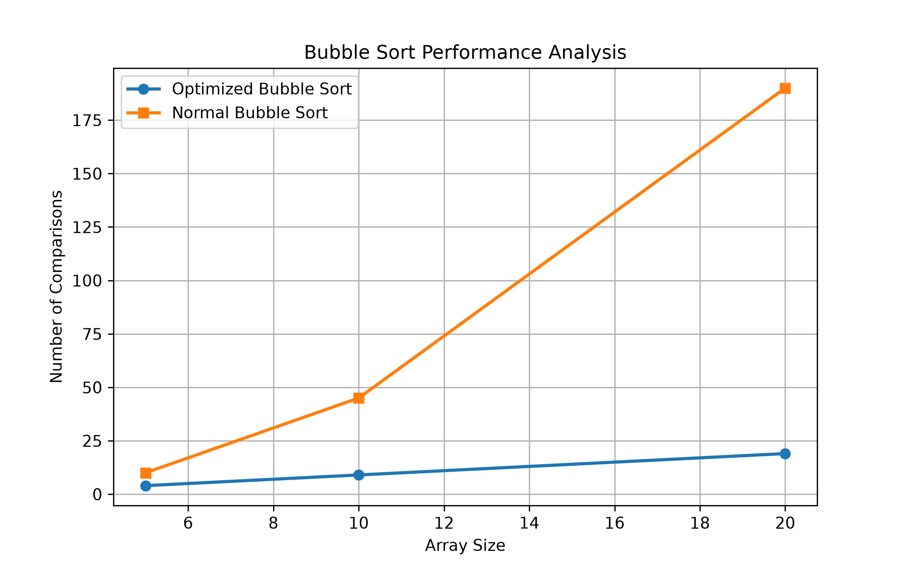
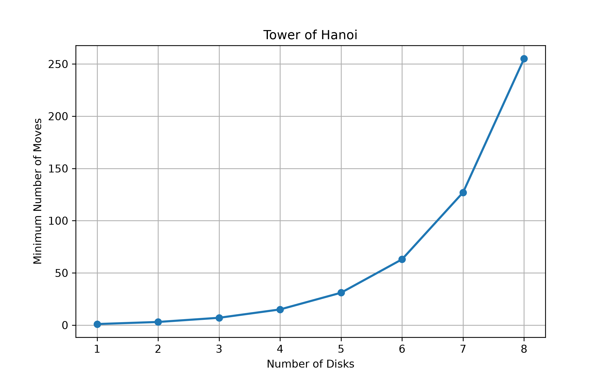
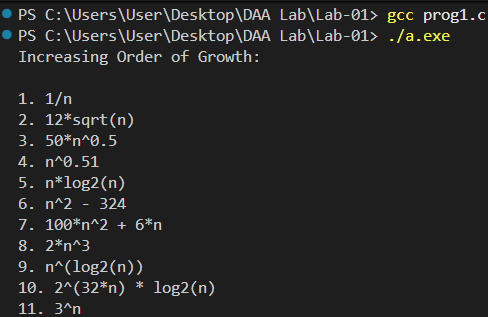
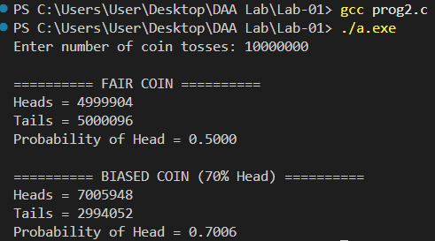
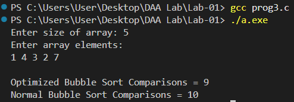
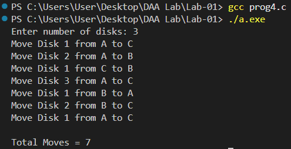
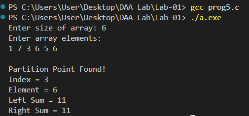
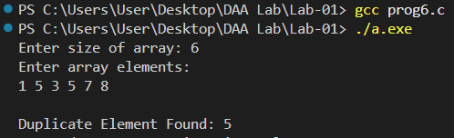

# 📘 Lab 01 - Design and Analysis of Algorithms

This folder contains the solutions to all the programs assigned in **Lab 01** of the **Design and Analysis of Algorithms (DAA)** course.

---

# 📋 Programs

| Question | Problem Statement | Status |
|----------|-------------------|--------|
| Q1       | Order of Growth | ✅ |
| Q2       | Fair vs Biased Coin Simulation | ✅ |
| Q3       | Bubble Sort Performance Analysis | ✅ |
| Q4       | Tower of Hanoi | ✅ |
| Q5       | Partition Point in an Array | ✅ |
| Q6       | Element Uniqueness | ✅ |

---

# 📂 Folder Structure

```
Lab-01
│
├── README.md
├── q1.c
├── q2.c
├── q3.c
├── q4.c
├── q5.c
├── q6.c
│
├── Outputs
│   ├── q1_output.png
│   ├── q2_output.png
│   ├── q3_output.png
│   ├── q4_output.png
│   ├── q5_output.png
│   └── q6_output.png
│
└── Graphs
    ├── q3_graph.png
    └── q4_graph.png
```

---

# 💻 Programming Language

- C

---

# 🛠 Software Used

- Visual Studio Code
- GCC Compiler
- Git
- GitHub

---

# 📊 Algorithms Used

| Question | Algorithm / Concept |
|----------|---------------------|
| Q1       | Order of Growth Analysis |
| Q2       | Randomized Simulation |
| Q3       | Bubble Sort |
| Q4       | Recursion |
| Q5       | Prefix Sum |
| Q6       | Brute Force Comparison |

---

# ⏱ Complexity Summary

| Question | Time Complexity | Space Complexity |
|----------|-----------------|------------------|
| Q1       | O(1)            | O(1) |
| Q2       | O(n)            | O(1) |
| Q3       | O(n²)           | O(1) |
| Q4       | O(2ⁿ)           | O(n) |
| Q5       | O(n)            | O(1) |
| Q6       | O(n²)           | O(1) |

---

# 📈 Performance Graphs

## Bubble Sort Performance



---

## Tower of Hanoi



---

# 📸 Program Outputs

| Question | Output |
|----------|--------|
| Q1 |  |
| Q2 |  |
| Q3 |  |
| Q4 |  |
| Q5 |  |
| Q6 |  |

---

# 🎯 Learning Outcomes

After completing this lab, the following concepts were understood:

- Asymptotic Analysis
- Probability Simulation
- Bubble Sort Optimization
- Recursion
- Prefix Sum Technique
- Time Complexity Analysis

---

**Lab Status:** ✅ Completed