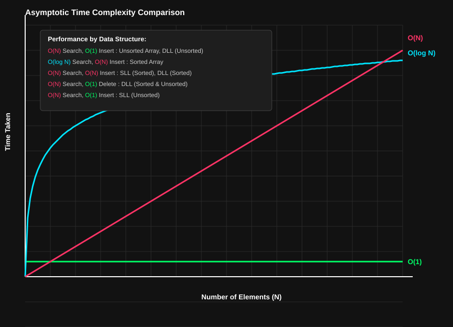
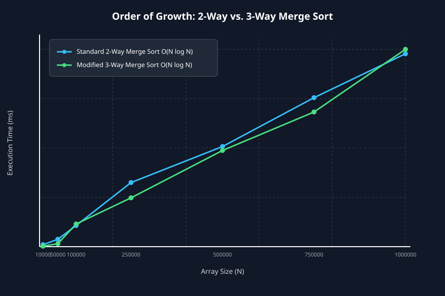
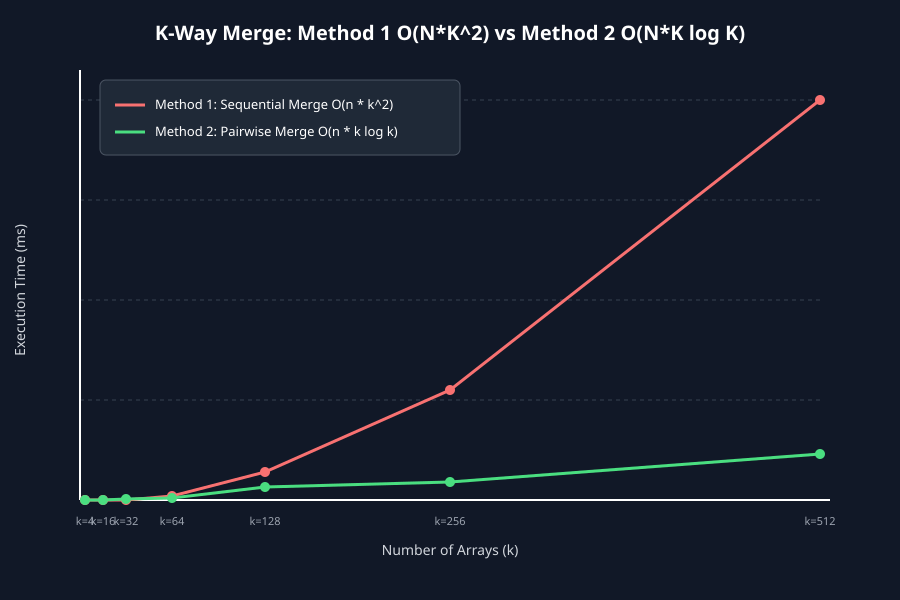

# 📘 DAA LAB – 02

## Design and Analysis of Algorithms

> **Experimental Analysis of Data Structures and Sorting/Merging Algorithms**

---

## 📑 Lab Overview

This lab consists of three experimental problems focused on **asymptotic analysis, algorithm design, benchmarking, and empirical validation**.

| Program | Problem | Main Concept |
|---|---|---|
| `prog1.c` | Dictionary Operations | Data Structure vs. Operation Complexity |
| `prog2.c` | 2-Way vs 3-Way Merge Sort | Divide-and-Conquer & Order of Growth |
| `prog3.c` | K-Way Merge | Sequential vs Pairwise Merging |

---

# 1️⃣ Dictionary ADT – Complexity Analysis

## 🎯 Objective

To implement and compare the primary operations of a Dictionary ADT using different data structures:

- Unsorted Array
- Sorted Array
- Unsorted Singly Linked List
- Sorted Singly Linked List
- Unsorted Doubly Linked List
- Sorted Doubly Linked List

The operations considered are:

- Search
- Insert
- Delete
- Minimum
- Maximum
- Predecessor
- Successor

---

## ⏱️ Worst-Case Complexity

| Data Structure | Search | Insert | Delete | Min/Max |
|---|---:|---:|---:|---:|
| Unsorted Array | `O(N)` | `O(1)` | `O(N)` | `O(N)` |
| Sorted Array | `O(log N)` | `O(N)` | `O(N)` | `O(1)` |
| Unsorted SLL | `O(N)` | `O(1)` | `O(N)` | `O(N)` |
| Sorted SLL | `O(N)` | `O(N)` | `O(N)` | `O(1)` |
| Unsorted DLL | `O(N)` | `O(1)` | `O(1)`* | `O(N)` |
| Sorted DLL | `O(N)` | `O(N)` | `O(1)`* | `O(1)` |

> **Note:** `O(1)` deletion for a linked list assumes that a direct pointer/reference to the node is already available.

---

## 📈 Asymptotic Growth Graph

### Performance Comparison



### 🔍 Observation

The graph compares three important growth rates:

- 🟢 **`O(1)`** – Constant
- 🔵 **`O(log N)`** – Logarithmic
- 🔴 **`O(N)`** – Linear

As the number of elements increases:

```text
O(1) < O(log N) < O(N)
```

Therefore, operations with constant or logarithmic complexity scale much better than linear operations for large input sizes.

---

## 🖥️ Experimental Output

The program performs interactive testing of the implemented dictionary structures.

Example:

```text
================================================
     DICTIONARY ADT COMPLETE OPERATIONAL BENCHMARK
================================================

How Many elements do you want to insert? 5

5 Numbers Enter:
Element [1]: 5
Element [2]: 4
Element [3]: 3
Element [4]: 2
Element [5]: 1

---------------- DATA STRUCTURE STATES ----------------

1. Unsorted Array : 5 4 3 2 1
2. Sorted Array   : 1 2 3 4 5
3. Sorted DLL     : 1 <-> 2 <-> 3 <-> 4 <-> 5 <-> NULL

---------------- MIN / MAX TESTS ----------------

Unsorted Array -> Min: 1 | Max: 5
Sorted Array   -> Min: 1 | Max: 5
Sorted DLL     -> Min: 1 | Max: 5
```

The program subsequently tests:

- Search
- Predecessor
- Successor
- Minimum
- Maximum

---

# 2️⃣ 2-Way Merge Sort vs 3-Way Merge Sort

## 🎯 Objective

To compare the standard **2-way Merge Sort** with a modified **3-way Merge Sort** and experimentally verify their order of growth.

---

## 🧠 Standard 2-Way Merge Sort

The array is divided into two parts:

```text
             N
           /   \
        N/2     N/2
        / \     / \
       ...     ...
```

The recurrence is:

```text
T(N) = 2T(N/2) + O(N)
```

Therefore:

```text
T(N) = O(N log N)
```

---

## 🧠 Modified 3-Way Merge Sort

The array is divided into three parts:

```text
              N
          /    |    \
       N/3    N/3    N/3
```

The recurrence is:

```text
T(N) = 3T(N/3) + O(N)
```

Therefore:

```text
T(N) = O(N log N)
```

### Important Result

Although the number of recursive divisions changes from **2 to 3**, the asymptotic complexity remains:

```text
O(N log N)
```

Both approaches therefore have the same worst-case order of growth.

---

## 📊 Experimental Benchmark

| Array Size `N` | 2-Way Time (ms) | 3-Way Time (ms) |
|---:|---:|---:|
| 10,000 | 0.667 | 0.667 |
| 50,000 | 10.000 | 11.667 |
| 100,000 | 20.667 | 18.667 |
| 250,000 | 48.333 | 38.667 |
| 500,000 | 53.667 | 51.667 |
| 750,000 | 134.000 | 111.000 |
| 1,000,000 | 120.000 | 108.333 |

> **Note:** Exact execution times may vary depending on processor load, compiler, operating system, and other runtime conditions. The important observation is the overall growth pattern.

---

## 📈 Experimental Growth Graph



### 🔍 Observation

Both algorithms demonstrate approximately the same asymptotic growth.

Therefore:

```text
2-Way Merge Sort → O(N log N)

3-Way Merge Sort → O(N log N)
```

The experimental results support the theoretical conclusion that modifying Merge Sort from two recursive divisions to three does **not** change its asymptotic complexity.

---

# 3️⃣ Merging K Sorted Arrays

## 🎯 Objective

Given `k` sorted arrays, two different approaches for merging them into one sorted array are compared.

For this experiment:

```text
n = 2000
```

where `n` represents the size of each individual array.

---

# Method 1️⃣ – Sequential Merging

The arrays are merged one at a time:

```text
A1 + A2
     ↓
Result + A3
     ↓
Result + A4
     ↓
...
     ↓
Result + Ak
```

The amount of data processed increases after every merge.

Therefore, the worst-case complexity is:

```text
O(nk²)
```

---

# Method 2️⃣ – Pairwise Merging

Arrays are merged in pairs:

```text
Round 1:

A1 + A2
A3 + A4
A5 + A6
...

Round 2:

Result1 + Result2
Result3 + Result4
...

Continue until one sorted array remains.
```

The number of merging levels is approximately:

```text
log k
```

Since every level processes approximately `nk` elements:

```text
O(nk log k)
```

---

## 📊 Experimental Benchmark

| Number of Arrays `k` | Method 1 (ms) | Method 2 (ms) |
|---:|---:|---:|
| 4 | 0.000 | 0.667 |
| 16 | 1.333 | 1.000 |
| 32 | 3.667 | 1.333 |
| 64 | 15.667 | 7.667 |
| 128 | 64.667 | 22.667 |
| 256 | 235.333 | 42.667 |
| 512 | 598.000 | 43.333 |

---

## 📈 Experimental Growth Graph



### 🔍 Observation

As `k` increases, Method 1 grows significantly faster than Method 2.

The experimental results support the theoretical analysis:

```text
Method 1 → O(nk²)

Method 2 → O(nk log k)
```

Therefore, **pairwise merging is significantly more scalable for large values of `k`**.

---

# 📊 Overall Complexity Comparison

| Problem | Algorithm / Approach | Complexity |
|---|---|---|
| Dictionary | Unsorted Array Search | `O(N)` |
| Dictionary | Sorted Array Search | `O(log N)` |
| Dictionary | Unsorted Array Insert | `O(1)` |
| Dictionary | Sorted Array Insert | `O(N)` |
| Merge Sort | Standard 2-Way | `O(N log N)` |
| Merge Sort | Modified 3-Way | `O(N log N)` |
| K-Way Merge | Sequential | `O(nk²)` |
| K-Way Merge | Pairwise | `O(nk log k)` |

---

# 🎯 Key Takeaways

## 1. Data Structure Selection Matters

Different data structures provide different performance characteristics.

There is no single structure that is optimal for every dictionary operation.

The choice of data structure should depend on which operations are expected to be performed most frequently.

---

## 2. 2-Way vs 3-Way Merge Sort

Changing the number of divisions from two to three does **not** change the asymptotic complexity:

```text
O(N log N)
```

Both approaches have the same worst-case order of growth.

---

## 3. Pairwise K-Way Merging is More Scalable

Sequential merging results in:

```text
O(nk²)
```

while pairwise merging achieves:

```text
O(nk log k)
```

Hence, pairwise merging becomes considerably more efficient as the number of arrays increases.

---

# 🧪 Theory vs Experiment

This lab demonstrates the complete algorithm-analysis workflow:

```text
Problem
   ↓
Algorithm Design
   ↓
Theoretical Complexity
   ↓
Implementation
   ↓
Benchmarking
   ↓
Experimental Data
   ↓
Graphical Analysis
   ↓
Conclusion
```

The experimental graphs provide empirical evidence supporting the theoretical asymptotic analysis.

---

# 📁 Lab 02 Structure

```text
Lab-02/
│
├── prog1.c
├── prog1.svg
│
├── prog2.c
├── prog2.svg
│
├── prog3.c
├── prog3.svg
│
├── merge_benchmark.dat
│
└── README.md
```

> The `.exe` files used during local execution are excluded from the repository using `.gitignore`.

---

# 🏁 Conclusion

The experiments demonstrate the importance of **asymptotic analysis** in evaluating algorithm scalability.

The results show that:

- Dictionary performance depends heavily on the underlying data structure.
- Both 2-way and 3-way Merge Sort have `O(N log N)` worst-case complexity.
- Pairwise K-way merging scales substantially better than sequential merging.
- Experimental benchmarking provides practical validation of theoretical complexity.

> **The key objective of this lab is not only to implement the algorithms, but to understand how their running time grows as the input size increases.**

---

## 👨‍💻 Author

**Sarthak Kumar Rout**

**Course:** Design and Analysis of Algorithms (DAA)  
**Lab:** 02  
**Branch:** Computer Science Engineering