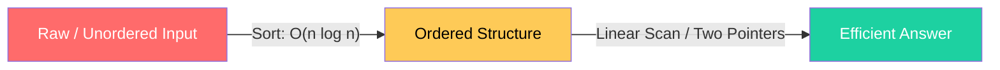
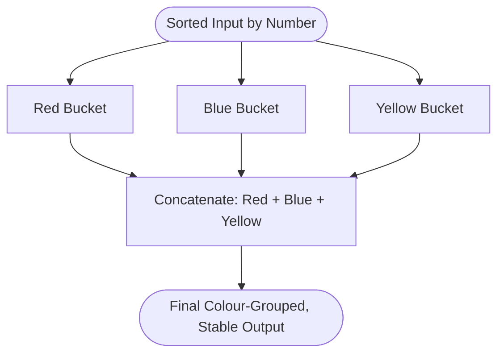
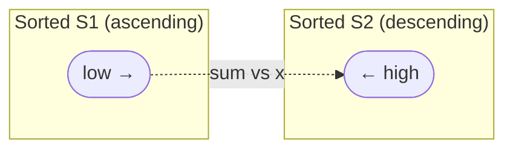
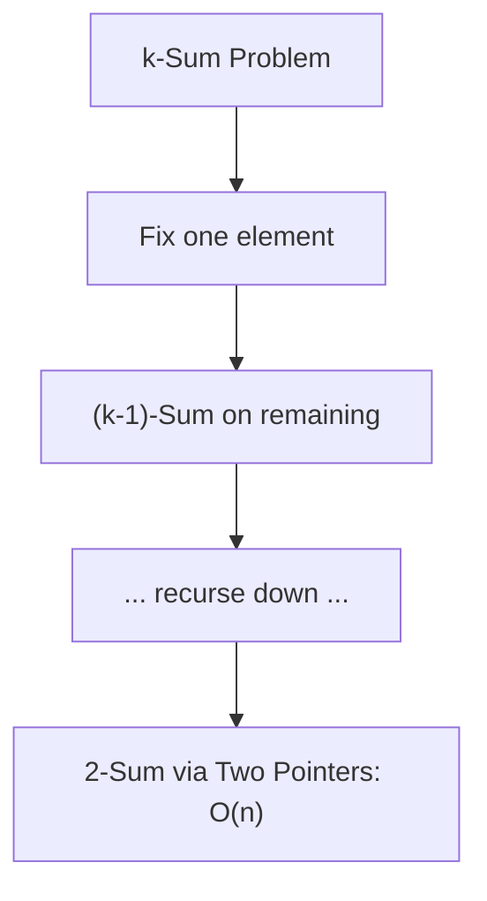
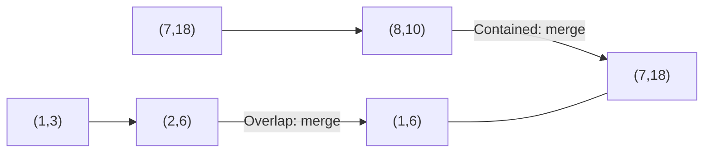
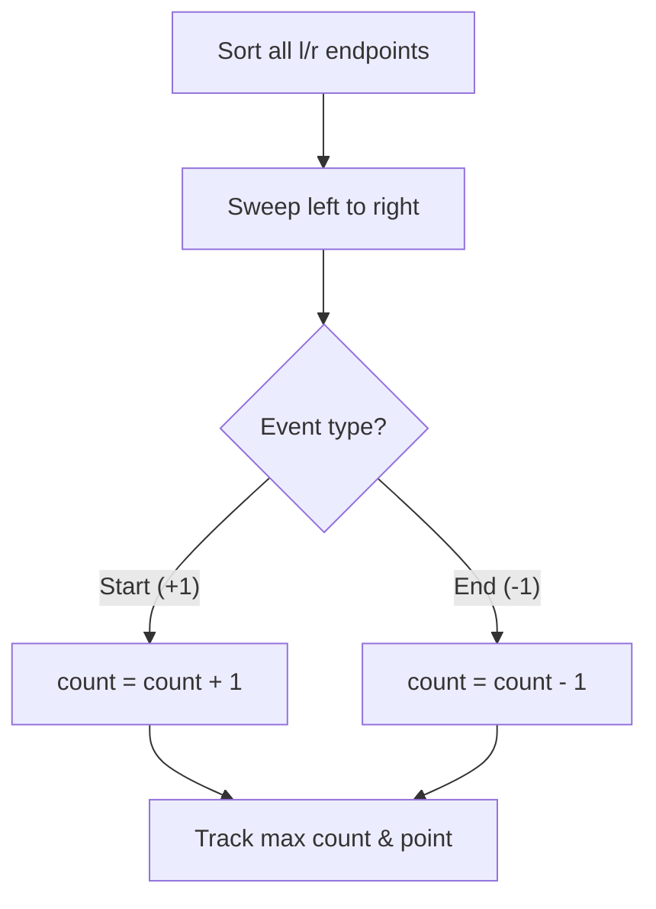
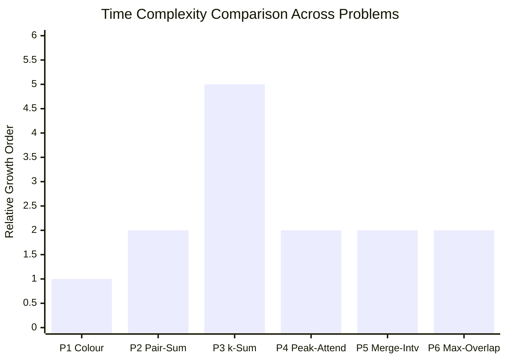

<div align="center">


</div>

---

## 📌 Lab Metadata

| Field | Detail |
|---|---|
| 🧪 **Lab No.** | 04 |
| 📘 **Course** | Design and Analysis of Algorithm (DAA) |
| 🎓 **Program** | BTech (CS-B and CE), 3rd Semester |
| 👨‍🏫 **Instructor** | Dr. Ajaya Kumar Dash |
| 📅 **Date** | August 18, 2026 |
| 🎯 **Theme** | Application of Sorting — turning brute-force problems into `O(n log n)` solutions |

---

## 🧠 Core Idea Behind This Lab

> Every problem in this lab looks intimidating in its "naive" form (`O(n²)`, `O(n³)`, or worse) — but a **single sort** at the start collapses the search space, letting the rest of the algorithm run in **one linear or logarithmic pass**.



---

## 📂 Problem Index

| # | Problem | Core Technique | Target Complexity |
|---|---------|-----------------|--------------------|
| 1 | [Sort by Colour (Stable Bucket)](#1--sort-by-colour-stable-3-way-partition) | Counting / Bucket logic on pre-sorted numeric order | `O(n)` |
| 2 | [Pair Sum Across Two Sets](#2--pair-sum-across-two-sets) | Sort + Two-Pointer | `O(n log n)` |
| 3 | [k-Sum Generalisation](#3--generalised-k-sum) | Sort + Recursive Two-Pointer Reduction | `O(nᵏ⁻¹ log n)` |
| 4 | [Peak Party Attendance](#4--peak-simultaneous-attendance) | Event/Timeline Sweep | `O(n log n)` |
| 5 | [Merge Overlapping Intervals](#5--merge-overlapping-intervals) | Sort by Start + Linear Merge | `O(n log n)` |
| 6 | [Max Point Interval Overlap](#6--maximum-point-overlap-in-intervals) | Sweep Line + Counter | `O(n log n)` |

---

## 🗂️ Repository Structure

```
Lab-04/
│
├── 📁 output/
│   ├── 🖼️ op1.png        # Output — Colour Sort
│   ├── 🖼️ op2.png        # Output — Pair Sum Across Two Sets
│   ├── 🖼️ op3.png        # Output — Generalised k-Sum
│   ├── 🖼️ op4.png        # Output — Peak Simultaneous Attendance
│   ├── 🖼️ op5.png        # Output — Merge Overlapping Intervals
│   └── 🖼️ op6.png        # Output — Maximum Point Overlap
│
├── 🇨 prog1.c             # Q1 · Sort by Colour                     → O(n)
├── 🇨 prog2.c             # Q2 · Pair Sum Across Two Sets            → O(n log n)
├── 🇨 prog3.c             # Q3 · Generalised k-Sum                   → O(nᵏ⁻¹ log n)
├── 🇨 prog4.c             # Q4 · Peak Simultaneous Attendance        → O(n log n)
├── 🇨 prog5.c             # Q5 · Merge Overlapping Intervals         → O(n log n)
├── ⚙️ prog5.exe           # Compiled binary (Q5)
├── 🇨 prog6.c             # Q6 · Maximum Point Overlap in Intervals  → O(n log n)
└── 📘 README.md           # You are here
```

| Program File | Problem Solved | Output |
|---|---|---|
| `prog1.c` | Sort by Colour | `output/op1.png` |
| `prog2.c` | Pair Sum Across Two Sets | `output/op2.png` |
| `prog3.c` | Generalised k-Sum | `output/op3.png` |
| `prog4.c` | Peak Simultaneous Attendance | `output/op4.png` |
| `prog5.c` | Merge Overlapping Intervals | `output/op5.png` |
| `prog6.c` | Maximum Point Overlap in Intervals | `output/op6.png` |

### ⚡ Build & Run

```bash
# Compile any program (example: prog1.c)
gcc prog1.c -o prog1

# Run it
./prog1        # Linux / macOS
prog1.exe      # Windows
```

> Repeat the same two steps for `prog2.c` → `prog6.c`. Each program is self-contained and reads/generates its own sample input as described in its corresponding problem section below.

---

<div align="center">

</div>

## 1. 🎨 Sort by Colour (Stable 3-Way Partition)

**Problem:** `n` (number, colour) pairs are already sorted by number. Reorder so all **reds → blues → yellows**, while numbers *within* the same colour stay sorted.

**Key Insight:** Since input is pre-sorted numerically, a **single pass bucket collection** (append each element to its colour's bucket, then concatenate buckets) preserves relative order automatically — no comparison sort needed.



| Complexity | Value |
|---|---|
| Time | `O(n)` |
| Space | `O(n)` |
| Stability | ✅ Preserved |

---

## 2. 🔗 Pair Sum Across Two Sets

**Problem:** Given `S₁`, `S₂` (size `n` each) and target `x`, determine if `a + b = x` for some `a ∈ S₁, b ∈ S₂`.

**Approach:** Sort `S₁` ascending and `S₂` descending (or use a hash-assist), then walk two pointers inward — classic **two-pointer convergence**.



| Case | Pointer Action |
|---|---|
| `sum < x` | move `S₁` pointer forward |
| `sum > x` | move `S₂` pointer forward |
| `sum == x` | ✅ Pair found |

**Complexity:** `O(n log n)` — dominated by sorting; scan itself is `O(n)`.

---

## 3. 🧩 Generalised k-Sum

**Problem:** Does some combination of `k` integers in `S` sum to `T`?

**Approach:** Sort once (`O(n log n)`), then **recursively reduce** the k-Sum problem to (k−1)-Sum, bottoming out at a 2-Sum solved via two pointers.



**Recurrence intuition:**

| Level | Work Done | Cost |
|---|---|---|
| Sort | once | `O(n log n)` |
| Outer k−2 nested loops | fix elements | `O(n^{k-2})` |
| Innermost 2-Sum | two-pointer scan | `O(n)` |
| **Total** | | **`O(nᵏ⁻¹ log n)`** |

---

<div align="center">

</div>

## 4. 🎉 Peak Simultaneous Attendance

**Problem:** Given entry `aᵢ` and exit `bᵢ` for `n` guests, find the instant with the **most people present**.

**Approach — Event Sweep:**
1. Create `2n` events: `(aᵢ, +1)` and `(bᵢ, −1)`.
2. Sort all events by time.
3. Sweep left→right, maintaining a running counter; track the **maximum**.

```mermaid
gantt
    dateFormat  X
    axisFormat %s
    title Timeline Sweep - Entries vs Exits
    section Guests
    Guest A :a1, 1, 6
    Guest B :a2, 2, 8
    Guest C :a3, 4, 10
    Guest D :a4, 5, 7
```



| Step | Operation | Cost |
|---|---|---|
| Build events | `2n` entries | `O(n)` |
| Sort events | by time | `O(n log n)` |
| Sweep & count | linear pass | `O(n)` |
| **Total** | | **`O(n log n)`** |

---

## 5. 🧷 Merge Overlapping Intervals

**Problem:** Merge all overlapping `(x, y)` intervals.
`{(1,3),(2,6),(8,10),(7,18)} → {(1,6),(7,18)}`

**Approach:** Sort intervals by **start point**, then sweep once, merging whenever the current interval overlaps the last merged one.



**Merge Condition:** if `next.start ≤ current.end` → merge to `(current.start, max(current.end, next.end))`, else push `next` as a new interval.

**Complexity:** `O(n log n)` — sort dominates; merge sweep is `O(n)`.

---

## 6. 📍 Maximum Point Overlap in Intervals

**Problem:** Find a point `p` covered by the **maximum number of intervals** (endpoints inclusive).
`{(10,40),(20,60),(50,90),(15,70)} → p = 50` covers 3 intervals.

**Approach — Sweep Line with Balanced Counter:**
1. Create events `(l, +1)` and `(r, −1)` per interval — sort **starts before ends** on ties (endpoint-inclusive rule).
2. Sweep, track running count, record the point where count peaks.



**Complexity:** `O(n log n)` — identical structure to Problem 4, applied spatially instead of temporally.

---

## 📊 Complexity Landscape — All Six Problems



> *Bar height is a relative growth-order indicator (`O(n)`≈1, `O(n log n)`≈2, `O(nᵏ⁻¹ log n)` scales with `k`) — not a literal runtime measurement.*

| Problem | Growth Class |
|---|---|
| 1️⃣ Colour Sort | 🟢 Linear |
| 2️⃣ Pair Sum | 🟡 Log-linear |
| 3️⃣ k-Sum | 🔴 Polynomial × log |
| 4️⃣ Peak Attendance | 🟡 Log-linear |
| 5️⃣ Merge Intervals | 🟡 Log-linear |
| 6️⃣ Max Overlap | 🟡 Log-linear |

---

## 🛠️ Tech Stack

<div align="center">

</div>

<div align="center">


-orange?style=flat-square)

</div>

---

## ✅ Key Takeaways

- 🔑 **Sorting is the universal pre-processor** — it converts unordered chaos into a structure where greedy sweeps or two-pointer scans become valid.
- 🔁 **Two-pointer technique** appears repeatedly (Problems 2 & 3) once data is ordered.
- 📈 **Sweep-line / event-based thinking** unifies Problems 4 and 6 — both reduce to "add an event, track a running counter, record the peak."
- 🧩 **k-Sum shows how recursion + sorting** trades exponential brute force for a tighter polynomial bound.

---

<div align="center">


**Made with 🧠 + ☕ for DAA Lab-04 · IIIT Bhubaneswar**

</div>