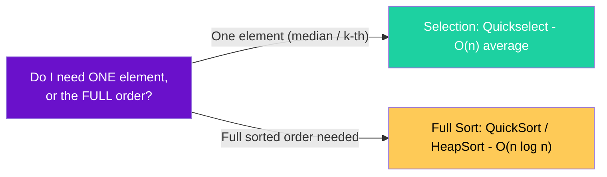
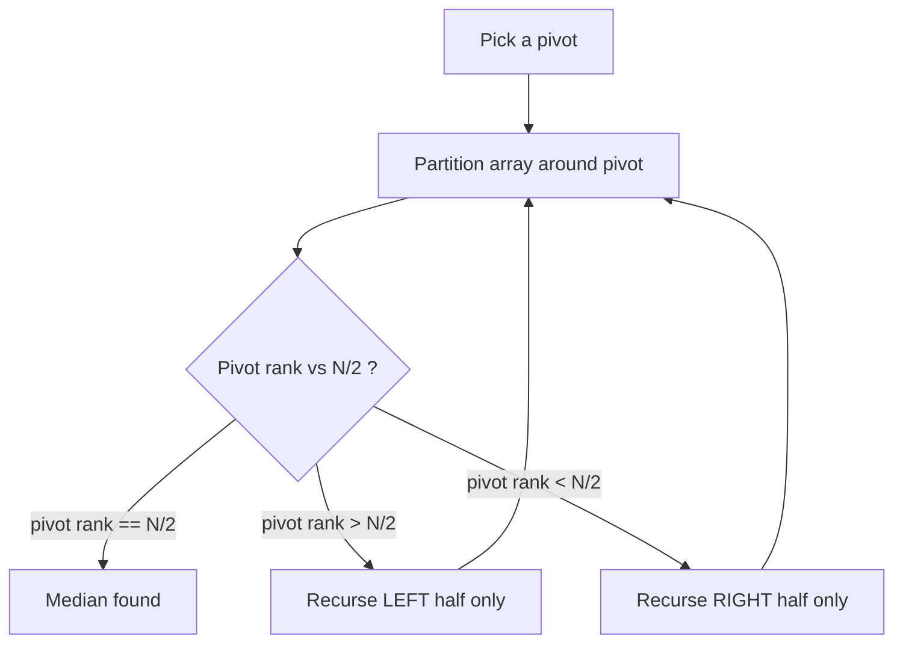
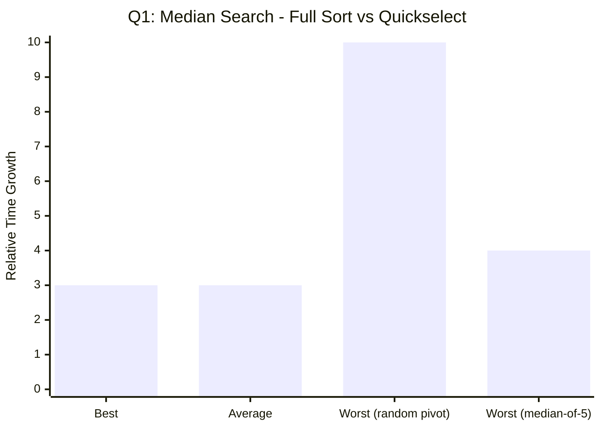
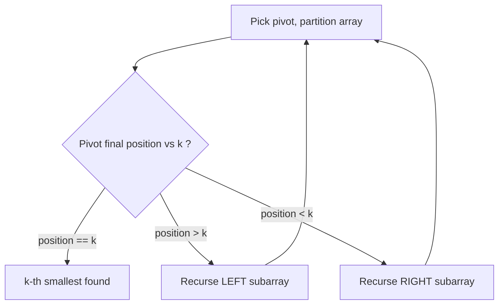
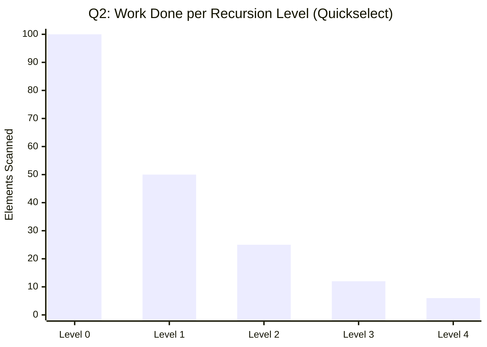
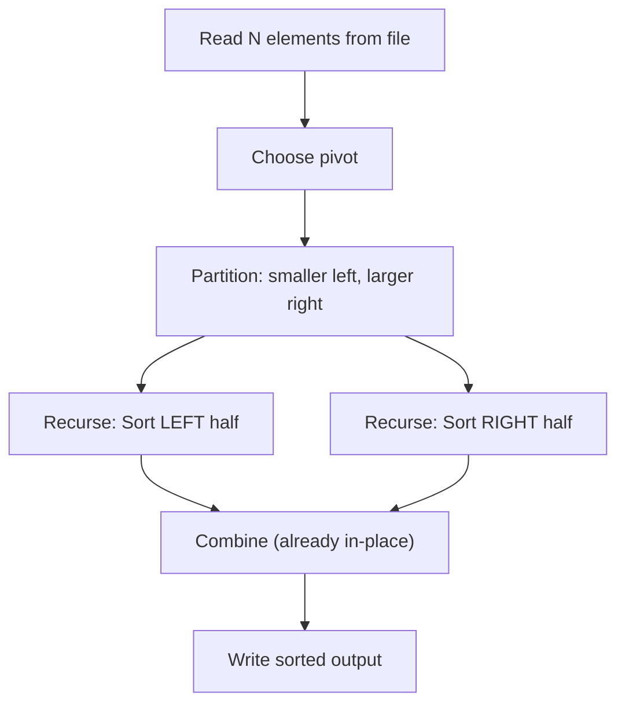
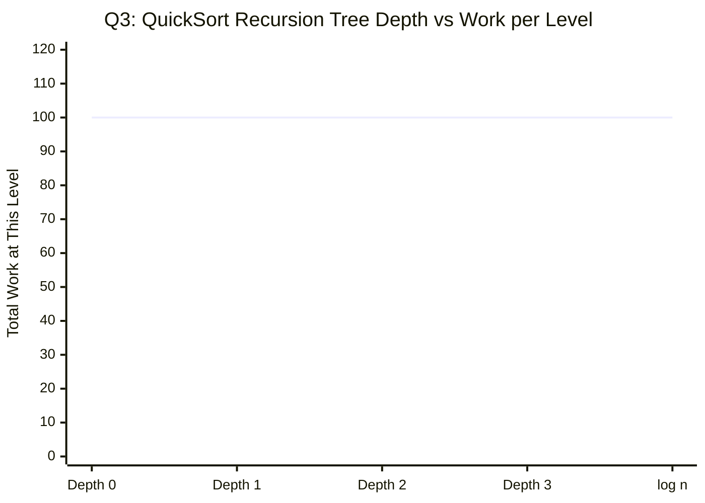
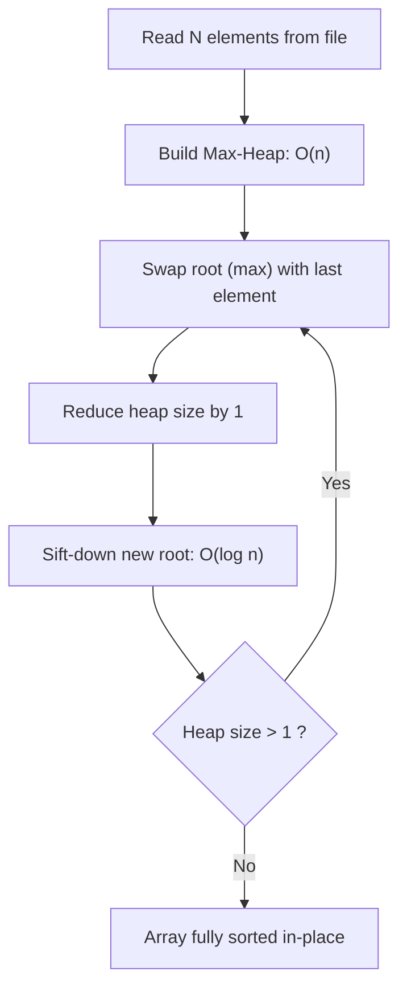
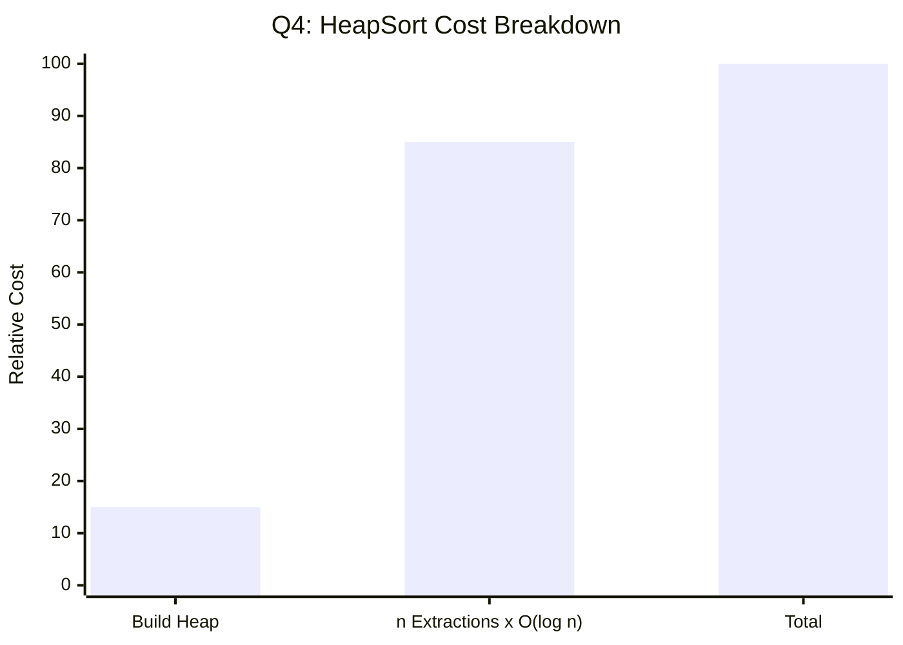
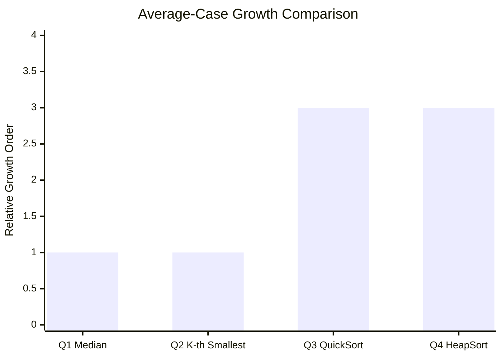

<div align="center">


</div>

---

## 📌 Lab Metadata

| Field | Detail |
|---|---|
| 🧪 **Lab No.** | 05 |
| 📘 **Course** | Design and Analysis of Algorithm (DAA) |
| 🎓 **Program** | BTech (CS-B and CE), 3rd Semester |
| 🎯 **Theme** | Selection algorithms (median / k-th smallest) **without full sorting**, plus two classic `O(n log n)` sorts |

---

## 🧠 Core Idea Behind This Lab

> Sorting an entire array just to find *one* value (the median, or the k-th smallest) is wasteful — it does `O(n log n)` work to answer a question that needs far less. This lab is about **selection vs. sorting**: knowing when a full sort is overkill, and when it's exactly the right tool.



---

## 📂 Problem Index

| # | Problem | Core Technique | Average Case | Worst Case |
|---|---------|-----------------|----------------|-------------|
| 1 | [Median without Sorting](#1--find-the-median-without-sorting) | Quickselect / Median-of-Medians | `O(n)` | `O(n)`* / `O(n²)` |
| 2 | [K-th Smallest without Sorting](#2--find-the-kth-smallest-element-without-sorting) | Quickselect (Hoare's selection) | `O(n)` | `O(n²)` |
| 3 | [QuickSort on File Data](#3--quicksort-on-n-random-elements-from-a-file) | Divide & Conquer, in-place partition | `O(n log n)` | `O(n²)` |
| 4 | [HeapSort on File Data](#4--heapsort-on-n-random-elements-from-a-file) | Binary Heap (build + extract) | `O(n log n)` | `O(n log n)` |

<sub>* `O(n)` worst case only if Median-of-Medians is used as the pivot strategy; plain Quickselect degrades to `O(n²)` in the worst case.</sub>

---

<div align="center">

</div>

## 1. 🎯 Find the Median without Sorting

**Problem:** Given `N` numbers, find the median **without sorting the full list**.

**Approach — Quickselect:** The median is just "the (N/2)-th smallest element." Use the QuickSort partitioning idea, but recurse into **only the half that contains the target rank** instead of both halves — this is what saves the work a full sort would do.



| Strategy | Time Complexity | Notes |
|---|---|---|
| Random-pivot Quickselect | `O(n)` average, `O(n²)` worst | Simple, fast in practice |
| Median-of-Medians pivot | `O(n)` **guaranteed worst case** | More overhead, used when worst case matters |



> Full sort (`O(n log n)`) sits *above* Quickselect's average case on every input size — the whole point of selection is skipping that extra `log n` factor.

---

## 2. 🔍 Find the K'th Smallest Element without Sorting

**Problem:** Generalises Q1 — find the element that would sit at position `k` in sorted order, without sorting.

**Approach:** Identical Quickselect machinery, just recurse toward rank `k` instead of `N/2`.



**Why average case is `O(n)`:** Each partition step is `O(current size)`, and because we only recurse into **one side**, the work shrinks geometrically: `n + n/2 + n/4 + ... ≈ 2n → O(n)`.



| Case | Time Complexity | Why |
|---|---|---|
| Best / Average | `O(n)` | Geometric shrink — only one side recursed |
| Worst | `O(n²)` | Consistently unbalanced partitions (e.g. sorted input + bad pivot choice) |

---

<div align="center">

</div>

## 3. ⚡ QuickSort on N Random Elements (from a File)

**Problem:** Read `N` randomly generated elements from a file, sort them with QuickSort.

**Approach:** Classic divide-and-conquer — pick a pivot, partition so smaller elements land left and larger land right, then **recurse into both halves** (unlike Quickselect, which only recurses into one).



**Recurrence:** `T(n) = 2T(n/2) + O(n)` on balanced splits → `O(n log n)` by the Master Theorem.



> Every level of the recursion tree does `O(n)` total work, and a balanced tree has `O(log n)` levels → `n × log n` total.

| Pivot Choice | Time Complexity | Cause |
|---|---|---|
| Random / median-ish | `O(n log n)` average | Balanced partitions |
| Already sorted data + first/last element pivot | `O(n²)` worst | Maximally unbalanced partitions every time |
| Space | `O(log n)` | Recursion stack (in-place partitioning) |

---

## 4. 🏔️ HeapSort on N Random Elements (from a File)

**Problem:** Read `N` randomly generated elements from a file, sort them with HeapSort.

**Approach:** Two phases — **build a max-heap** from the raw array, then repeatedly **extract the maximum** to the end of the array and re-heapify what remains.



**Why it's always `O(n log n)`:** Building the heap is `O(n)` (a well-known tighter bound than the naive `O(n log n)`), and there are `n` extractions, each costing `O(log n)` to restore heap order — no dependence on input arrangement, so **best, average, and worst case are identical**.



| Phase | Time Complexity |
|---|---|
| Build max-heap | `O(n)` |
| `n` × extract-max + sift-down | `O(n log n)` |
| **Total (best = average = worst)** | **`O(n log n)`** |
| Space | `O(1)` — sorts in-place, no extra array needed |

---

## 📊 Complexity Landscape — All Four Problems



| Problem | Average Case | Worst Case | Space |
|---|---|---|---|
| 1️⃣ Median (Quickselect) | 🟢 `O(n)` | 🔴 `O(n²)`* | `O(1)` |
| 2️⃣ K-th Smallest (Quickselect) | 🟢 `O(n)` | 🔴 `O(n²)` | `O(1)` |
| 3️⃣ QuickSort | 🟡 `O(n log n)` | 🔴 `O(n²)` | `O(log n)` |
| 4️⃣ HeapSort | 🟡 `O(n log n)` | 🟡 `O(n log n)` | `O(1)` |

<sub>* becomes `O(n)` guaranteed with Median-of-Medians pivot selection.</sub>

---

## 🛠️ Tech Stack

<div align="center">

</div>

<div align="center">


</div>

---

## ✅ Key Takeaways

- 🎯 **Selection ≠ Sorting.** Quickselect answers "what's the k-th element?" in linear average time by discarding half the problem at each step — full sorting would waste a `log n` factor.
- ⚖️ **Pivot choice is everything.** The same partitioning idea powers Quickselect *and* QuickSort — good pivots give `O(n)` / `O(n log n)`; bad pivots (e.g. always picking an extreme on sorted data) degrade both to quadratic time.
- 🏔️ **HeapSort trades average-case speed for worst-case guarantees.** It's always `O(n log n)` — no adversarial input can make it slow — at the cost of usually running a bit slower in practice than a well-pivoted QuickSort.
- 🧮 **Build-heap being `O(n)` (not `O(n log n)`)** is a classic "surprising tight bound" worth remembering — the sum of work across heap levels telescopes down instead of multiplying flatly.

---

## 🗂️ Repository Structure

```
Lab-05/
│
├── 📁 Outputs/
│   ├── 🖼️ prog1-op.png    # Output — Median without Sorting
│   ├── 🖼️ prog2-op.png    # Output — K-th Smallest without Sorting
│   ├── 🖼️ prog3-op.png    # Output — QuickSort on File Data
│   └── 🖼️ prog4-op.png    # Output — HeapSort on File Data
│
├── 🇨 prog1.c             # Q1 · Median without Sorting   → O(n) avg
├── 🇨 prog2.c             # Q2 · K-th Smallest             → O(n) avg
├── 🇨 prog3.c             # Q3 · QuickSort (file input)    → O(n log n) avg
├── 🇨 prog4.c             # Q4 · HeapSort (file input)     → O(n log n)
└── 📘 README.md           # You are here
```

| Program File | Problem Solved | Output |
|---|---|---|
| `prog1.c` | Median without Sorting | `Outputs/prog1-op.png` |
| `prog2.c` | K-th Smallest without Sorting | `Outputs/prog2-op.png` |
| `prog3.c` | QuickSort on File Data | `Outputs/prog3-op.png` |
| `prog4.c` | HeapSort on File Data | `Outputs/prog4-op.png` |

### ⚡ Build & Run

```bash
# Compile any program (example: prog1.c)
gcc prog1.c -o prog1

# Run it
./prog1        # Linux / macOS
prog1.exe      # Windows
```

> Repeat for `prog2.c` → `prog4.c`. Programs 3 and 4 read `N` randomly generated elements from a file — make sure your input file is in the same directory before running.

---

<div align="center">


**Made with 🧠 + ☕ for DAA Lab-05 · IIIT Bhubaneswar**

</div>