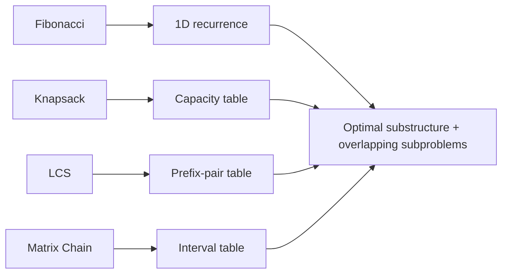

# Lab-06 - Complexity Analysis and Dynamic Programming

## Problem map

This Lab-06 keeps both supplied sheets in one ordered submission: Questions 1-4 come from the complexity-analysis PDF; Questions 5-8 come from the Dynamic Programming brief.

| # | Program | What it demonstrates | Time / space |
| --- | --- | --- | --- |
| 1 | `prog1.c` | nine 1D array operations | mostly `O(n)`, sort-based tasks `O(n log n)` |
| 2 | `prog2.c` | seven square-matrix operations | `O(n^2)` to `O(n^3)` |
| 3 | `prog3.c` | FFT-based vector convolution | `O(N log N)` / `O(N)` |
| 4 | `prog4.c` | reversal-only sorting | `O(n)` reversals; `O(n log^2 n)` weighted cost |
| 5 | `prog5.c` | bottom-up Fibonacci | `O(n)` / `O(n)` |
| 6 | `prog6.c` | 0/1 Knapsack with reconstruction | `O(nW)` / `O(nW)` |
| 7 | `prog7.c` | LCS length and subsequence | `O(mn)` / `O(mn)` |
| 8 | `prog8.c` | optimal Matrix Chain order | `O(n^3)` / `O(n^2)` |

## Animated visual aids

| Array scans | Matrix cells | FFT recombination | Reversal merge |
| --- | --- | --- | --- |
|  |  |  |  |

The animations are backed by a dependency-free generator at [`tools/generate_visuals.py`](tools/generate_visuals.py).



## Dynamic Programming equations

```text
F[i] = F[i-1] + F[i-2]
K[i][w] = max(K[i-1][w], profit[i] + K[i-1][w-weight[i]])
L[i][j] = L[i-1][j-1]+1 if X[i]==Y[j], else max(L[i-1][j], L[i][j-1])
M[i][j] = min(M[i][k] + M[k+1][j] + d[i-1]d[k]d[j])
```

## Build

```bash
gcc -std=c99 -Wall -Wextra -O2 prog1.c -o prog1 -lm
gcc -std=c99 -Wall -Wextra -O2 prog2.c -o prog2 -lm
gcc -std=c99 -Wall -Wextra -O2 prog3.c -o prog3 -lm
gcc -std=c99 -Wall -Wextra -O2 prog4.c -o prog4
gcc -std=c99 -Wall -Wextra -O2 prog5.c -o prog5
gcc -std=c99 -Wall -Wextra -O2 prog6.c -o prog6
gcc -std=c99 -Wall -Wextra -O2 prog7.c -o prog7
gcc -std=c99 -Wall -Wextra -O2 prog8.c -o prog8
```

## Quick DP demonstrations

```text
# prog5: 10                         -> F(10) = 55
# prog6: 3 50; (10,60) (20,100) (30,120) -> maximum profit = 220
# prog7: ABCBDAB / BDCABA           -> LCS length = 4
# prog8: 4; 10 30 5 60              -> minimum cost = 4500
```

Each program prints its complexity beside the result and validates its input range. `prog6.c` backtracks selected items; `prog7.c` reconstructs an LCS; `prog8.c` prints optimal parenthesization as well as cost.
