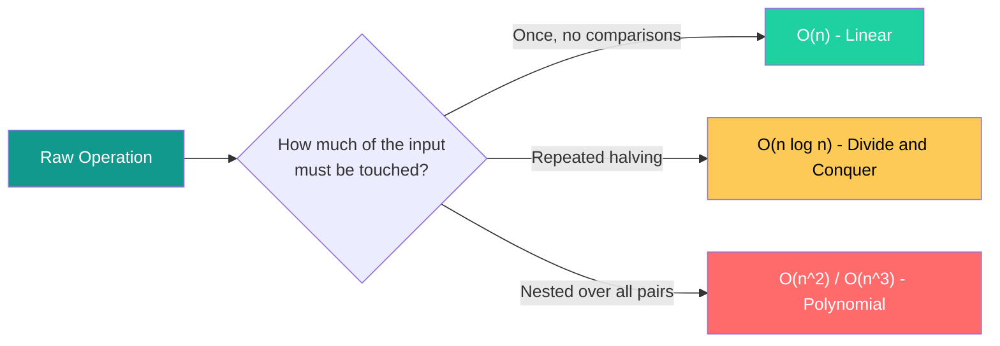
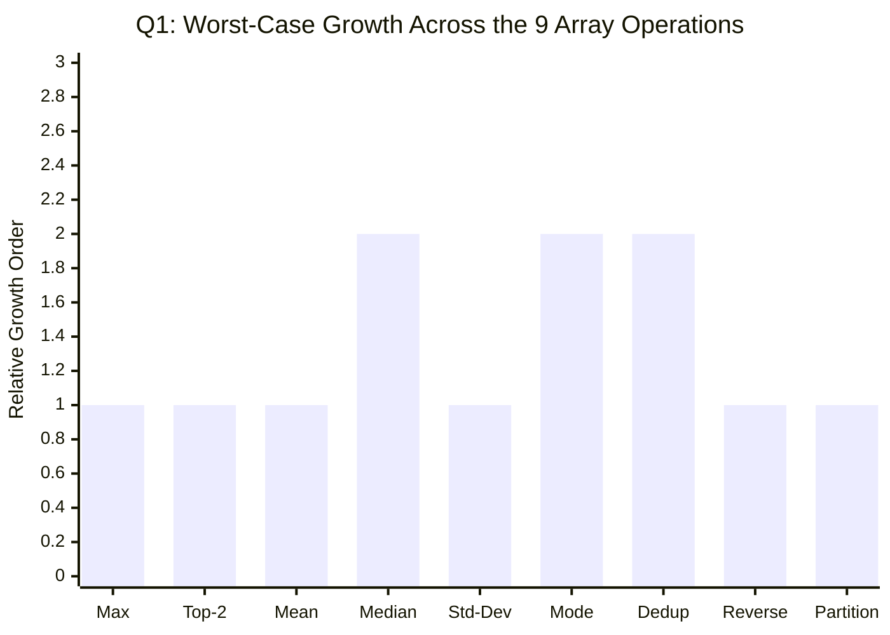
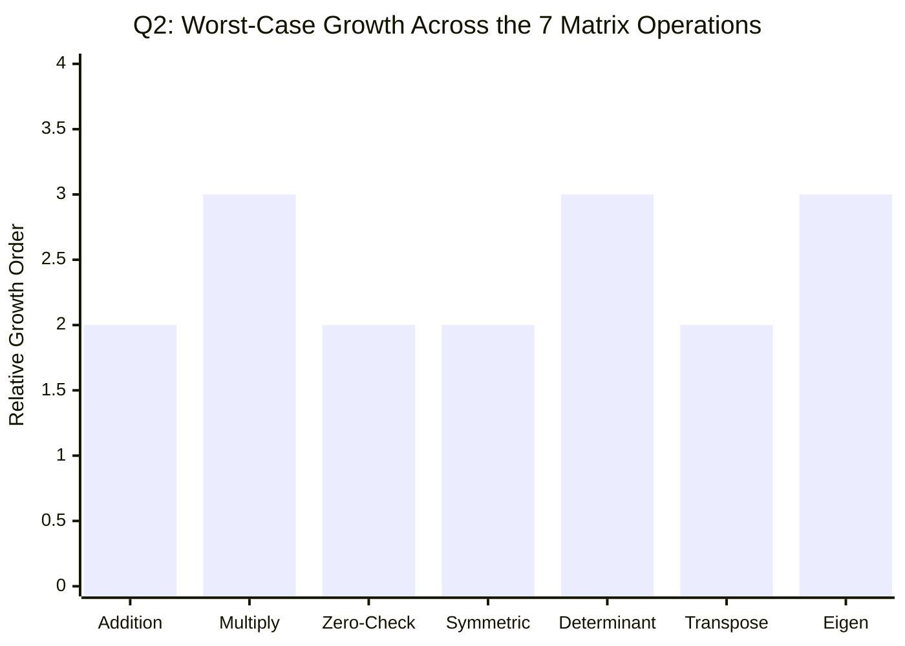
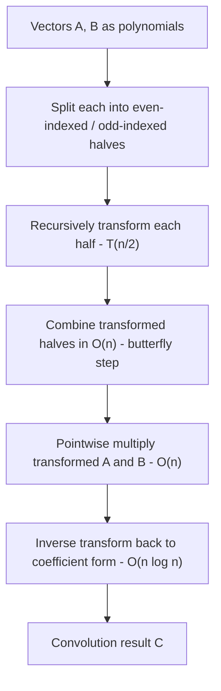
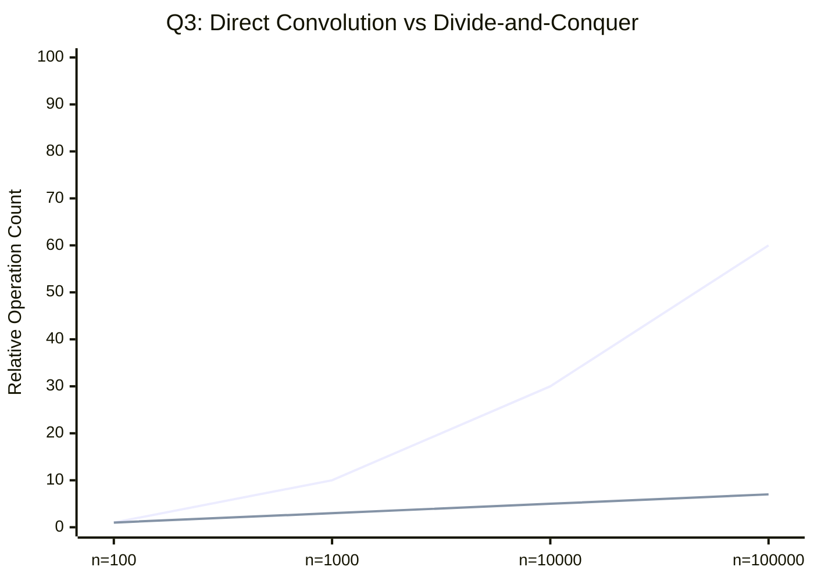
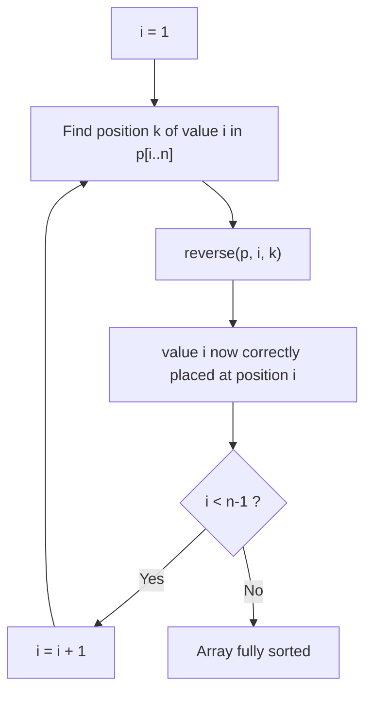
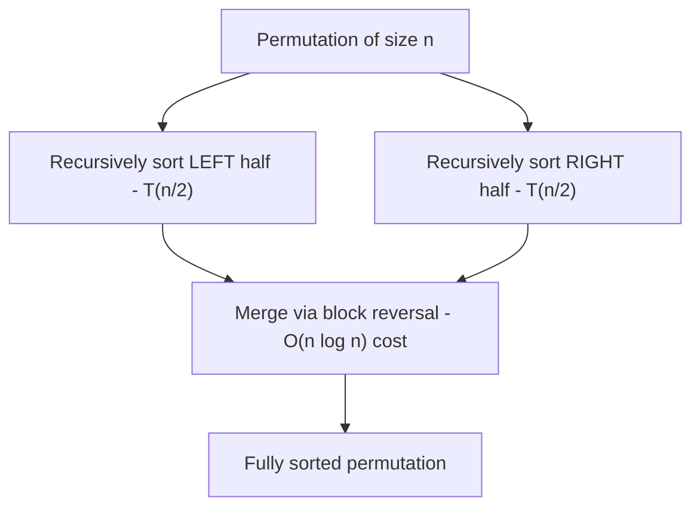
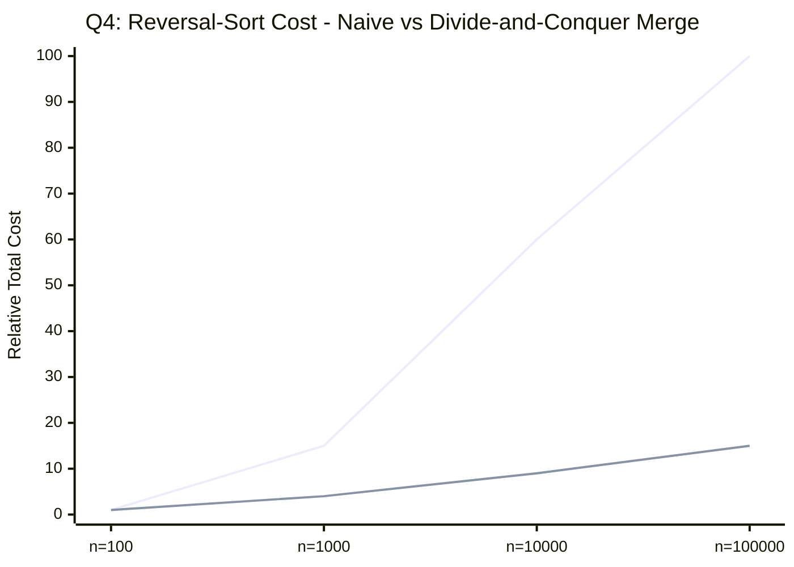
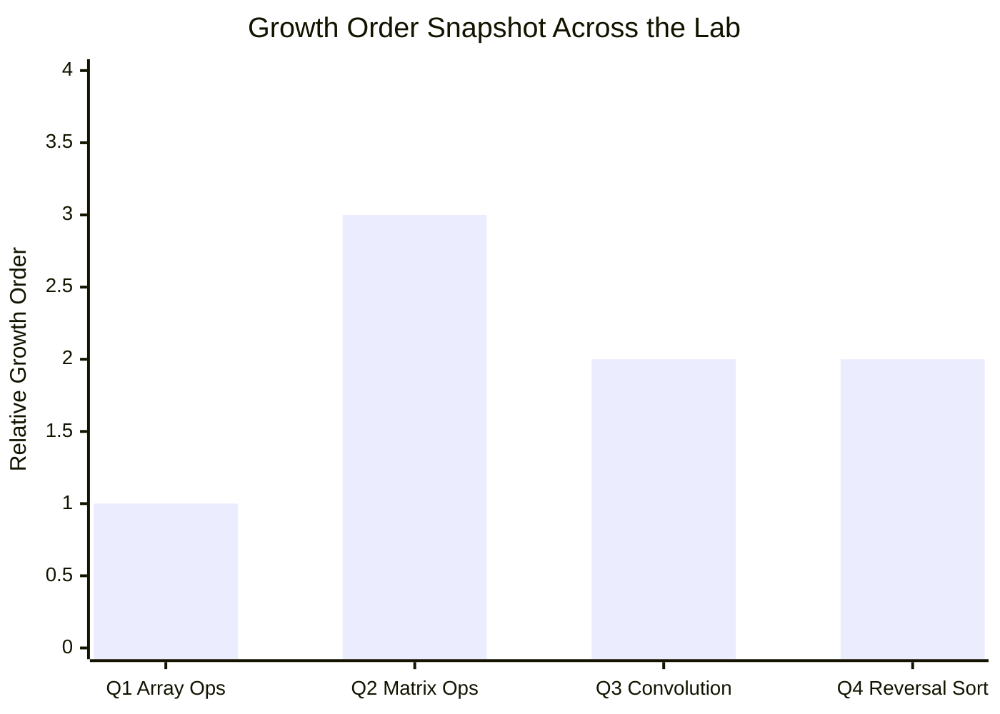

<div align="center">


</div>

---

## 📌 Lab Metadata

| Field | Detail |
|---|---|
| 🧪 **Lab No.** | 06 |
| 📘 **Course** | Design and Analysis of Algorithm (DAA) |
| 🎓 **Program** | BTech (CS-B and CE), 3rd Semester |
| 📅 **Date** | August 31, 2026 |
| 👨‍🏫 **Instructor** | Dr. Ajaya Kumar Dash |
| 🎯 **Theme** | Complexity anatomy of everyday operations — arrays, matrices, divide-and-conquer, and a clever sorting constraint |

---

## 🧠 Core Idea Behind This Lab

> Not every problem needs a fancy algorithm — but *every* operation has a cost, and this lab is about **naming that cost precisely**: from a single linear scan of an array, to `O(n³)` matrix work, to squeezing a convolution down to `O(n log n)` with divide-and-conquer, to sorting under a bizarre "reversal-only" constraint.



---

## 📂 Problem Index

| # | Problem | Core Idea | Complexity Range |
|---|---------|-----------|--------------------|
| 1 | [1D Array Operations](#1--1d-array-operations-and-their-complexities) | 9 classic array queries, worst-case each | `O(n)` → `O(n log n)` |
| 2 | [2D Matrix Operations](#2--2d-square-matrix-operations-and-their-complexities) | 7 classic `n×n` matrix operations | `O(n²)` → `O(n³)` |
| 3 | [Convolution via Divide & Conquer](#3--convolution-operation-on-vectors-of-size-n) | FFT-style D&C convolution | `O(n log n)` |
| 4 | [Sorting via Reversal](#4--sorting-via-reversal-procedure) | Bound reversal count, then bound reversal *cost* | `O(n)` reversals · `O(n log² n)` cost |

---

<div align="center">

</div>

## 1. 📏 1D Array Operations and Their Complexities

**Setup:** An unsorted array of `n` integers. For each operation below, we derive the **worst-case** complexity.

| # | Operation | Worst-Case Complexity | Why |
|---|---|---|---|
| i | Maximum element | `O(n)` | One linear scan, track running max |
| ii | First & second largest | `O(n)` | Single pass, track top-2 running values |
| iii | Mean | `O(n)` | Sum in one pass, divide by `n` |
| iv | Median | `O(n log n)`* | Sort then pick middle — *drops to `O(n)` with a selection algorithm (Lab-05!)* |
| v | Standard deviation | `O(n)` | One pass for mean, one pass for squared deviations — still linear |
| vi | Mode | `O(n log n)`* | Sort + linear scan for longest run — *`O(n)` possible via hashing if value range allows* |
| vii | Remove all duplicates | `O(n log n)`* | Sort then skip repeats — *`O(n)` possible via hashing (extra space)* |
| viii | Reverse the array | `O(n)` | Swap from both ends inward, `n/2` swaps |
| ix | Partition around random pivot | `O(n)` | One Lomuto/Hoare-style pass, in-place |

<sub>* Two valid strategies exist for iv, vi, vii — a sort-based `O(n log n)` approach (works for any comparable type) or a hash/selection-based `O(n)` approach (needs extra space or a boundable value range). Both are worth showing in your program's complexity discussion.</sub>



> Seven of the nine operations are pure `O(n)` — the only two that climb to `O(n log n)` (median, mode) do so *only* when you lean on sorting rather than a smarter selection/hashing trick.

---

## 2. 🧮 2D Square Matrix Operations and Their Complexities

**Setup:** Square matrices with `n` rows and `n` columns.

| # | Operation | Worst-Case Complexity | Why |
|---|---|---|---|
| i | Matrix addition | `O(n²)` | Touch every one of the `n²` cells exactly once |
| ii | Matrix multiplication | `O(n³)` naive | Triple nested loop — `n²` output cells, each an `O(n)` dot product <br>*(Strassen's algorithm improves this to ≈`O(n^2.807)`)* |
| iii | Check zero matrix | `O(n²)` | Must inspect every cell in the worst case |
| iv | Check symmetric matrix | `O(n²)` | Compare `A[i][j]` with `A[j][i]` for all pairs |
| v | Determinant | `O(n³)` | Via Gaussian elimination / LU decomposition — naive cofactor expansion is `O(n!)`, avoid it |
| vi | Transpose in-place | `O(n²)` | Swap `A[i][j] ↔ A[j][i]` for the upper triangle only |
| vii | Eigenvalue / eigenvector | `O(n³)` per iteration | No closed form beyond `n = 4`; iterative methods (e.g. QR algorithm) repeat `O(n³)` steps until convergence |



> Anything that must **combine** two full matrices (multiplication) or **reduce** one to a scalar via elimination (determinant, eigenvalues) jumps a full order to `O(n³)` — everything that just **reads or rearranges** cells stays at `O(n²)`.

---

<div align="center">

</div>

## 3. 🔊 Convolution Operation on Vectors of Size n

**Problem:** Compute `C[k] = Σ A[j]·B[k−j]` for vectors `A` (length `m`) and `B` (length `n`, `n ≥ m`), in `O(n log n)` using divide-and-conquer.

**Approach — Frequency-Domain Divide & Conquer (FFT-style):** Direct convolution is `O(n·m)` — for every output index you sum over all valid `j`. The `O(n log n)` trick treats each vector as a polynomial's coefficients and recursively **splits by even/odd index** (just like the Fast Fourier Transform), multiplies in the transformed domain, then combines back.



**Recurrence:** `T(n) = 2·T(n/2) + O(n)` → by the Master Theorem, `T(n) = O(n log n)`.



> Top line: naive `O(n·m)` direct convolution. Bottom line: `O(n log n)` divide-and-conquer — the gap widens dramatically as `n` grows.

| Approach | Time Complexity | Notes |
|---|---|---|
| Direct summation | `O(n·m)` | Simple but slow for large vectors |
| Divide & Conquer (FFT-style) | `O(n log n)` | Requires `n ≥ m`; pad `B` with zeros to match a power-of-two length |

---

## 4. 🔄 Sorting via Reversal Procedure

**Problem:** Given a permutation of `1..n`, sort it using only `reverse(p, i, j)` — reversing a contiguous subrange.

### Part A — Sorting in `O(n)` reversals

**Claim:** Any permutation can be sorted using at most `2(n−1)` reversals.

**Proof sketch (Selection-by-Reversal):** For each position `i` from `1` to `n−1`:
1. Find the position `k` of value `i` in the unsorted suffix.
2. `reverse(p, i, k)` — this brings value `i` to the front of the unsorted suffix, but possibly *reversed relative to its neighbours* — one reversal is actually enough to place it exactly at position `i` since reversing `[i, k]` puts the element that was at `k` directly into position `i`.



| Metric | Bound |
|---|---|
| Reversals used | `O(n)` — at most one per position, `n−1` total |
| Time to *find* each reversal (naive) | `O(n)` per step → `O(n²)` overall for this simple version |

### Part B — Bounding the total *cost* to `O(n log² n)`

Here the cost of `reverse(p, i, j)` is its length `|j − i| + 1`, so the *naive* Part-A approach (each reversal can cost up to `O(n)`) totals `O(n²)` cost in the worst case — too expensive.

**Approach — Divide & Conquer Merge via Reversal:** Recursively sort the left and right halves of the permutation, then **merge them using rotations built from reversals** (the classic "reverse three blocks" trick: `reverse(A); reverse(B); reverse(A+B)` rotates `A` and `B` past each other in a cost proportional to their combined length, similar to array-rotation-by-reversal).



**Recurrence:** `T(n) = 2·T(n/2) + O(n log n)` — the extra `log n` factor in the merge step (each merge itself needs a logarithmic number of reversal passes to interleave blocks) gives, by the Master Theorem:

```
T(n) = O(n log² n)
```



> Top line: naive `O(n²)` reversal cost. Bottom line: `O(n log² n)` divide-and-conquer merge-by-reversal — the same "split, solve, combine" pattern from Q3, applied to a completely different constraint.

| Metric | Bound |
|---|---|
| Number of reversals | `O(n)` |
| Total *cost* (sum of reversal lengths) | `O(n log² n)` |
| Correctness | Each merge step preserves sortedness of the combined range by construction of the block-reversal rotation |

---

## 📊 Complexity Landscape — All Four Problems



| Problem | Dominant Complexity | Technique Signature |
|---|---|---|
| 1️⃣ Array Operations | 🟢 mostly `O(n)`, up to `O(n log n)` | Single/linear passes, occasional sort |
| 2️⃣ Matrix Operations | 🔴 `O(n²)` to `O(n³)` | Nested loops over cells / elimination |
| 3️⃣ Convolution | 🟡 `O(n log n)` | Divide-and-conquer (FFT-style) |
| 4️⃣ Reversal Sort | 🟡 `O(n)` moves, `O(n log² n)` cost | Selection + divide-and-conquer merge |

---

## 🛠️ Tech Stack

<div align="center">

</div>

<div align="center">


</div>

---

## ✅ Key Takeaways

- 📏 **Not every array operation is equal.** Seven of nine classic array queries are plain `O(n)` — only median and mode tempt you into `O(n log n)` unless you reach for selection algorithms or hashing.
- 🧮 **Matrix operations jump a full order** the moment they *combine* rather than just *read* — multiplication and determinant both land at `O(n³)`, while addition, transpose, and checks stay at `O(n²)`.
- 🔊 **Divide-and-conquer beats brute force by trading multiplication for addition** — convolution's `O(n·m)` direct sum collapses to `O(n log n)` once you split, transform, and recombine.
- 🔄 **Constraints change the whole analysis.** Sorting via reversal is trivial in *reversal count* (`O(n)`), but bounding the *cost* of those reversals forces a completely different divide-and-conquer merge strategy — a great example of how the cost model shapes the algorithm.

---

## 🗂️ Repository Structure

```
Lab-06/
│
├── 📁 Outputs/
│   ├── 🖼️ output-1.png   # Output — 1D Array Operations
│   ├── 🖼️ output-2.png   # Output — 2D Matrix Operations
│   ├── 🖼️ output-3.png   # Output — Convolution via Divide & Conquer
│   └── 🖼️ output-4.png   # Output — Sorting via Reversal
│
├── 🇨 prog1.c             # Q1 · 1D Array Operations       → O(n) - O(n log n)
├── 🇨 prog2.c             # Q2 · 2D Matrix Operations      → O(n²) - O(n³)
├── 🇨 prog3.c             # Q3 · Convolution (D&C)         → O(n log n)
├── 🇨 prog4.c             # Q4 · Sorting via Reversal       → O(n log² n) cost
└── 📘 README.md           # You are here
```

| Program File | Problem Solved | Output |
|---|---|---|
| `prog1.c` | 1D Array Operations and Their Complexities | `Outputs/output-1.png` |
| `prog2.c` | 2D Square Matrix Operations and Their Complexities | `Outputs/output-2.png` |
| `prog3.c` | Convolution via Divide & Conquer | `Outputs/output-3.png` |
| `prog4.c` | Sorting via Reversal Procedure | `Outputs/output-4.png` |

### ⚡ Build & Run

```bash
# Compile any program (example: prog1.c)
gcc prog1.c -o prog1

# Run it
./prog1        # Linux / macOS
prog1.exe      # Windows
```

> Repeat for `prog2.c` → `prog4.c`. `prog2.c` expects square-matrix dimensions as input; `prog3.c` and `prog4.c` generate or read their own sample vectors/permutations as described in each problem section above.

---

<div align="center">


**Made with 🧠 + ☕ for DAA Lab-06 · IIIT Bhubaneswar**

</div>