<div align="center">


</div>

---

## 📌 Lab Metadata

| Field | Detail |
|---|---|
| 🧪 **Lab No.** | 07 |
| 📘 **Course** | Design and Analysis of Algorithm (DAA) |
| 🎓 **Program** | BTech (CS-B and CE), 3rd Semester |
| 📅 **Date** | September 8, 2026 |
| 👨‍🏫 **Instructor** | Dr. Ajaya Kumar Dash |
| 🎯 **Theme** | Algorithm application questions based on classic puzzles — medium to hard difficulty |

---

## 🧠 Core Idea Behind This Lab

> Puzzles look like brain-teasers, but every one of them hides a **recurrence relation** or a **greedy invariant** underneath. This lab is about spotting that structure — a Hanoi-style recursion, a parity argument, an event sweep — and turning "clever trick" into a provable, analyzable algorithm.

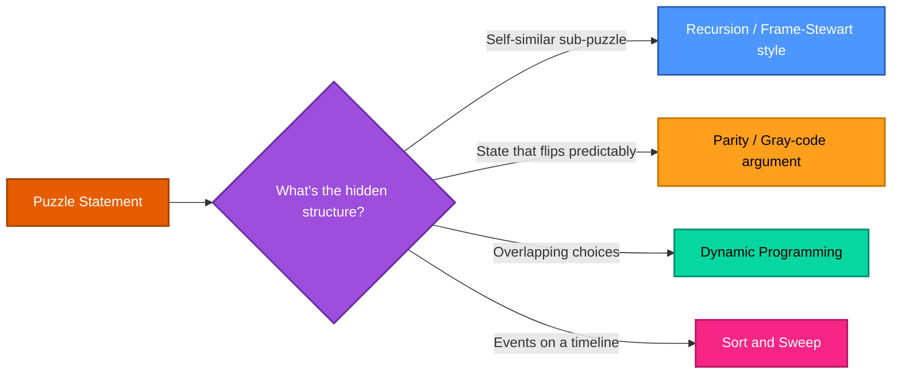

---

## 📂 Problem Index

| # | Puzzle | Core Idea | Complexity Signature |
|---|--------|-----------|------------------------|
| 1 | [Invert the Coin-Triangle](#1--invert-the-coin-triangle) | Overlap the triangle with its inverse, move mismatched coins | `Θ(n²)` moves |
| 2 | [Super Egg Testing](#2--super-egg-testing-experiment) | DP over (eggs, floors) state space | `O(E·F)` |
| 3 | [Reve's Puzzle](#3--reves-puzzle-4-peg-hanoi) | Frame–Stewart recursive splitting | `Θ(2^√(2n))` moves |
| 4 | [Security Switches](#4--security-switches) | Gray-code-like recursive toggling | `Θ(2ⁿ)` moves |
| 5 | [Hitting a Moving Target](#5--hitting-a-moving-target) | Parity-based sweep pattern | `O(n)` shots |
| 6 | [The Best Time to Be Alive](#6--the-best-time-to-be-alive) | Birth/death event sweep | `O(n log n)` |
| 7 | [Matrix Chain Multiplication](#7--matrix-chain-multiplication-mcm) | Interval DP over chain splits | `O(n³)` |

---

<div align="center">

</div>

## 1. 🪙 Invert the Coin-Triangle

**Problem:** Flip a triangular arrangement of `n` rows of coins upside down, sliding one coin at a time, using the **minimum number of moves**.

**Approach:** Overlap the original triangle with its upside-down target position. Coins sitting in cells common to both orientations never need to move — only coins in the "protruding" regions (present in the original but not the target, or vice versa) need to be slid across. Minimizing moves reduces to matching each unmatched original-position coin to the nearest unmatched target-position gap.

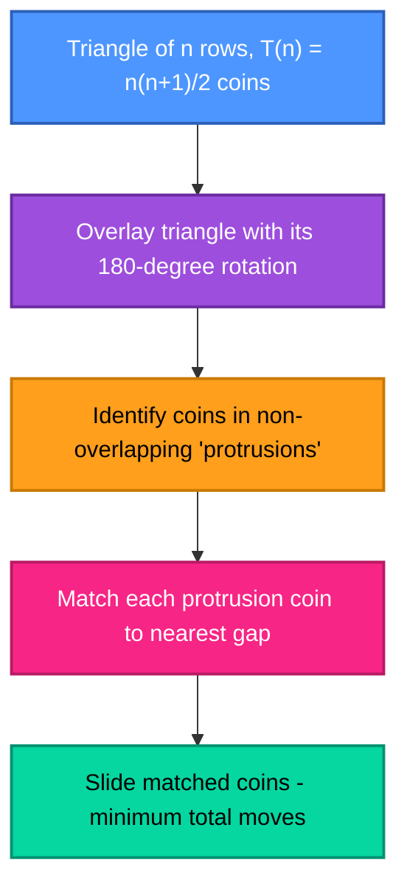

**Compact Formula:** For a triangle with `n` rows (`T(n) = n(n+1)/2` total coins):

```
Minimum moves M(n) = floor( T(n) / 3 ) = floor( n(n+1) / 6 )
```

> Verified against the classic 4-row (10-coin) case: `M(4) = floor(10/3) = 3` moves — the well-known textbook answer.

```mermaid
%%{init: {"themeVariables": {"xyChart": {"plotColorPalette": "#4D96FF, #F72585"}}}}%%
xychart-beta
    title "Q1: Total Coins vs Minimum Moves to Invert"
    x-axis ["n=4", "n=6", "n=8", "n=10", "n=12"]
    y-axis "Count" 0 --> 100
    bar [10, 21, 36, 55, 78]
    bar [3, 7, 12, 18, 26]
```

| Metric | Complexity |
|---|---|
| Moves required | `Θ(n²)` — roughly `1/3` of all `Θ(n²)` coins |
| Computing the formula | `O(1)` |
| Generating/validating the coordinate layout | `O(n²)` — one entry per coin |

---

## 2. 🥚 Super Egg Testing Experiment

**Problem:** With `E` eggs and `F` floors, find the minimum number of guaranteed droppings to determine the highest safe floor. Classic case: `E = 2`, `F = 100` → **14 drops**.

**Approach — Dynamic Programming:** Let `dp[e][f]` = minimum worst-case drops needed with `e` eggs and `f` floors. Dropping from floor `x` either breaks the egg (`e-1` eggs, `x-1` floors below to check) or doesn't (`e` eggs, `f-x` floors above to check) — take the worst of the two, then the best `x`.

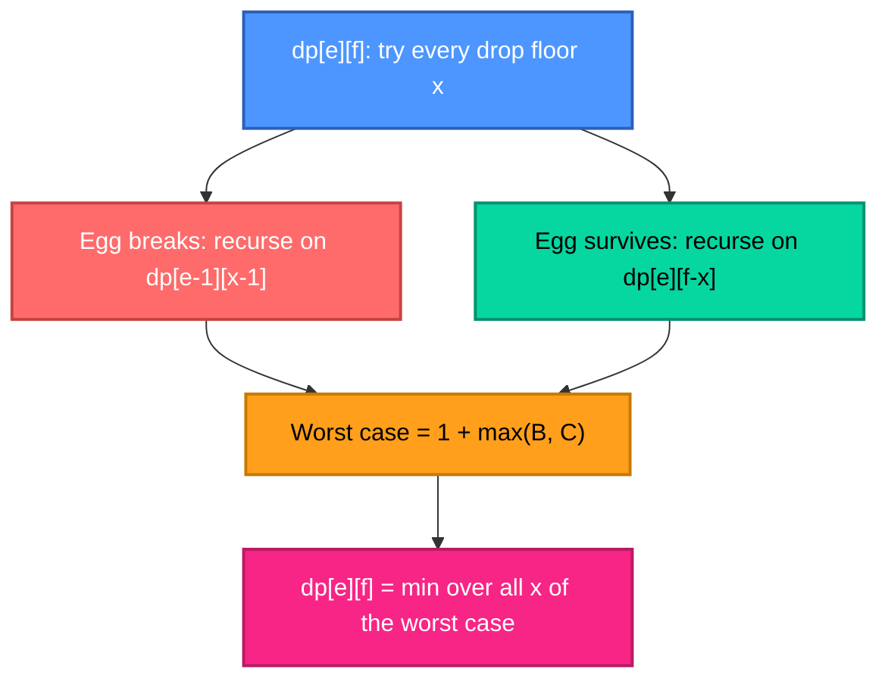

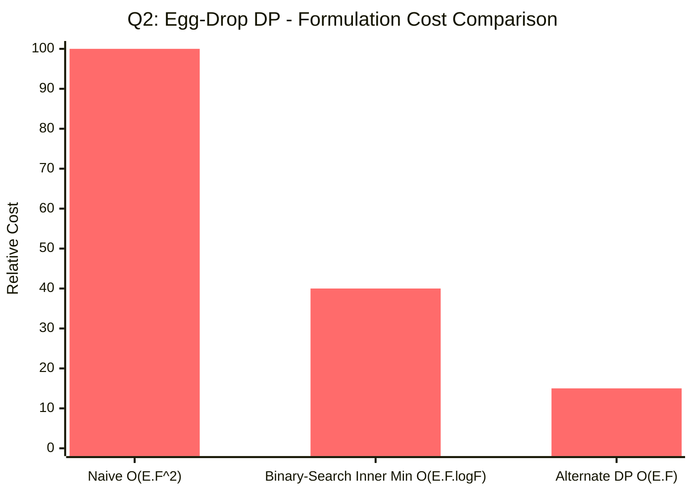

| Formulation | Time Complexity | Notes |
|---|---|---|
| Naive `dp[e][f]` trying every floor `x` | `O(E·F²)` | Simple, but slow for large `F` |
| Binary search on the inner minimization | `O(E·F log F)` | The inner function is unimodal in `x` |
| Alternate DP: `f(t, e)` = max floors distinguishable in `t` trials with `e` eggs | `O(E·F)` | Find min `t` such that `f(t, E) ≥ F` |
| Special case `E=2, F=100` | **14 drops** | From `k(k+1)/2 ≥ 100 ⟹ k = 14` |

---

<div align="center">

</div>

## 3. 🗼 Reve's Puzzle (4-Peg Hanoi)

**Problem:** 8 disks, 4 pegs — transfer all disks to another peg in the minimum number of moves (given: **33 moves**). Generalize for `n` disks.

**Approach — Frame–Stewart Algorithm:** Move the top `k` disks to a spare peg using all 4 pegs, move the remaining `n-k` disks to the target using classical 3-peg Hanoi (since one peg is now "locked" holding the top `k`), then move the `k` disks back onto the target using all 4 pegs again. Try all `k` and keep the cheapest.

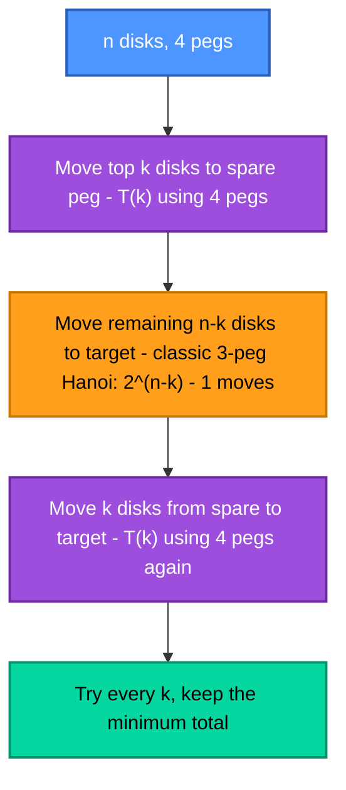

**Recurrence:** `T(n) = min over 1≤k<n of [ 2·T(k) + 2^(n-k) − 1 ]`, with `T(8) = 33` matching the lab's given answer.

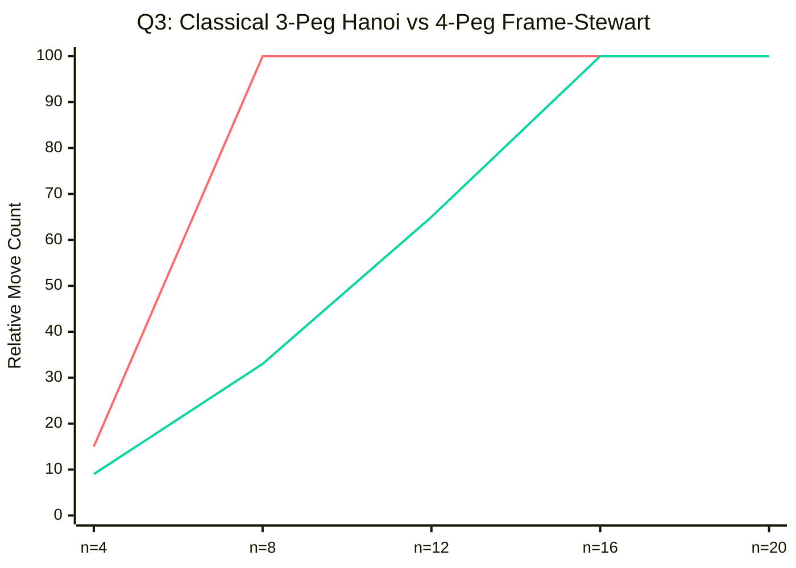

| Metric | Bound |
|---|---|
| Classical 3-peg Hanoi | `Θ(2ⁿ)` moves |
| Frame–Stewart (4-peg) | `Θ(2^√(2n))` moves — sub-exponential, still exponential |
| Optimality | Proven optimal for exactly 4 pegs (Bousch, 2014) |

---

## 4. 🔐 Security Switches

**Problem:** `n` switches, all initially **on**. Rightmost switch is always free to toggle; any other switch may only be toggled if the switch to its immediate right is on and every switch further right is off. Turn all switches **off** in the minimum number of moves.

**Approach — Recursive (Gray-code-style):** To turn off the leftmost switch, every switch to its right must first reach a specific pattern, recursively. This mirrors the structure of the **Chinese Rings puzzle** and generates a recurrence identical in shape to Tower of Hanoi.

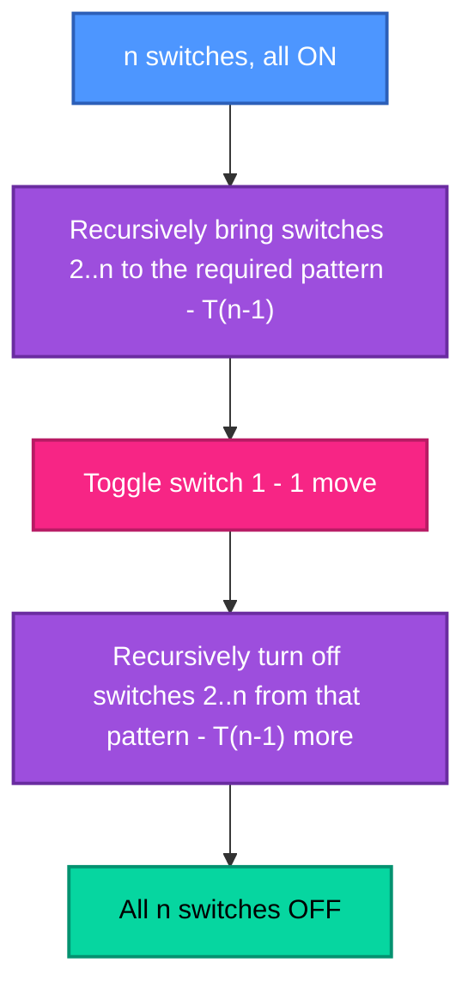

**Recurrence:** `T(n) = 2·T(n-1) + 1`, `T(0) = 0` → `T(n) = 2ⁿ − 1`.

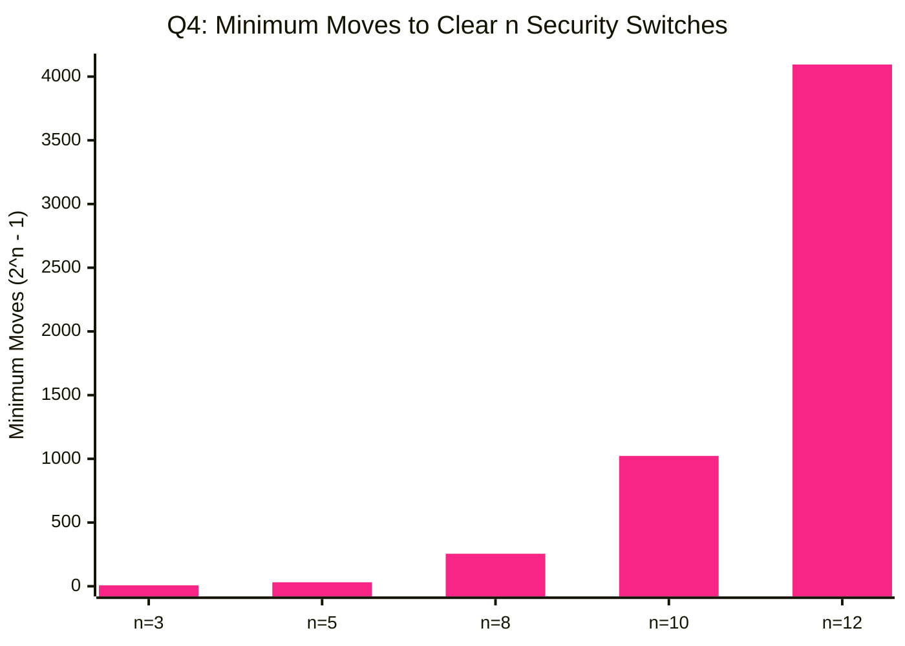

| Metric | Bound |
|---|---|
| Minimum moves | `2ⁿ − 1` |
| Generating the move sequence | `O(2ⁿ)` time, `O(1)` extra space per step (Gray-code bit trick) |

---

<div align="center">

</div>

## 5. 🎯 Hitting a Moving Target

**Problem:** `n` hiding spots on a line. The target moves to an **adjacent** spot between every two shots, and the shooter never sees it. Does a guaranteed-hit strategy exist?

**Approach — Parity Sweep:** A hidden object's position parity (odd/even index) flips every single move — but the shooter doesn't know the *starting* parity. Sweep once assuming one starting parity, then sweep again assuming the other: shoot positions `2, 3, 4, ..., n-1, n-1, n-2, ..., 2` covers every reachable position under both parity assumptions.

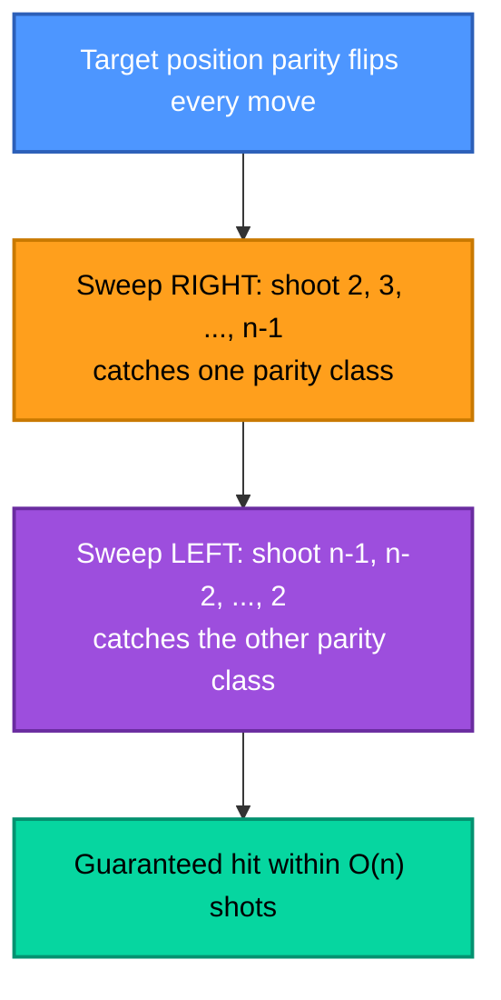

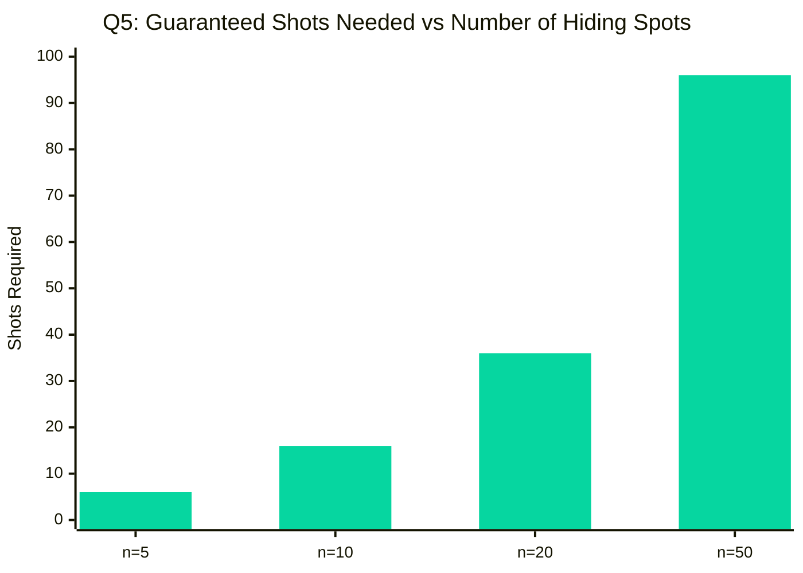

| Metric | Bound |
|---|---|
| **Existence** | ✅ Yes — a guaranteed-hit strategy exists |
| Shots required | `O(n)` — roughly `2(n-2)` in the worst case |

---

## 6. 📜 The Best Time to Be Alive

**Problem:** Given birth/death years of prominent scientists, find the year when the **most scientists were alive simultaneously**. (Ties broken: death counted as happening before a birth in the same year.)

**Approach — Event Sweep:** Create `+1` events at birth years and `−1` events at death years, sort all events chronologically (deaths before births in a tie), sweep once tracking a running "alive count," and record the peak.

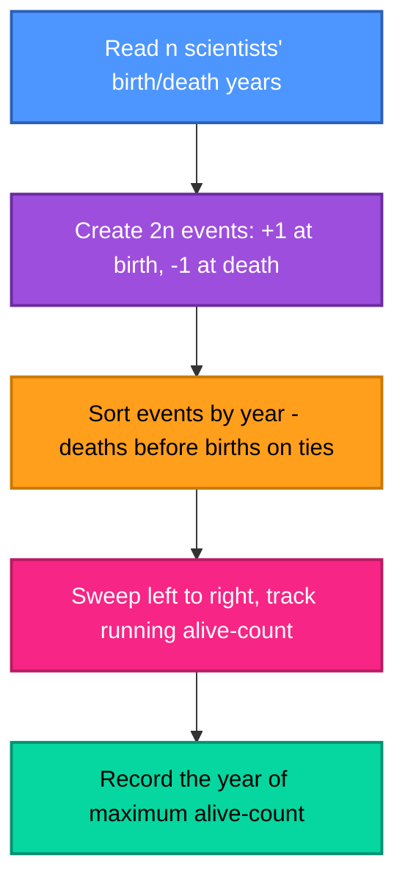

| Step | Cost |
|---|---|
| Build `2n` events | `O(n)` |
| Sort events | `O(n log n)` |
| Sweep & track max | `O(n)` |
| **Total** | **`O(n log n)`** |

> Same event-sweep pattern as "Peak Simultaneous Attendance" from Lab-04 — a recurring technique whenever intervals overlap on a timeline.

---

## 7. ⛓️ Matrix Chain Multiplication (MCM)

**Problem:** Find the minimum number of scalar multiplications needed to multiply a chain of matrices, and reconstruct the optimal multiplication order.

**Approach — Interval DP:** `dp[i][j]` = minimum cost to multiply matrices `i` through `j`. Try every split point `k` inside the range; also store the best `k` in a separate table to reconstruct the actual parenthesization afterward.

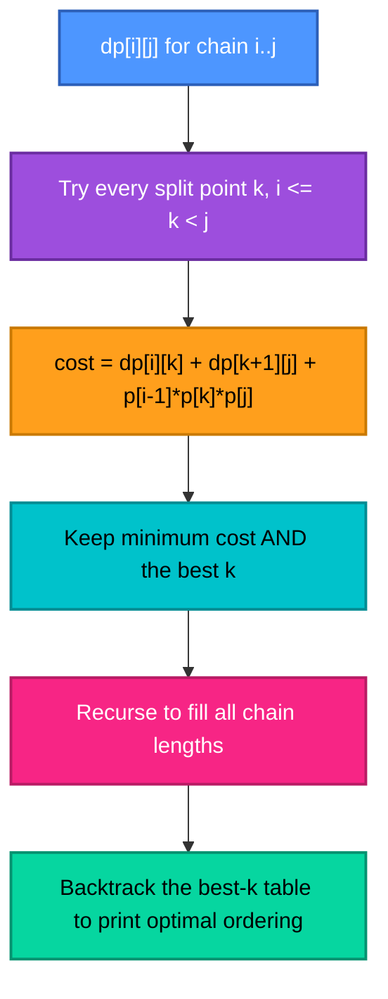

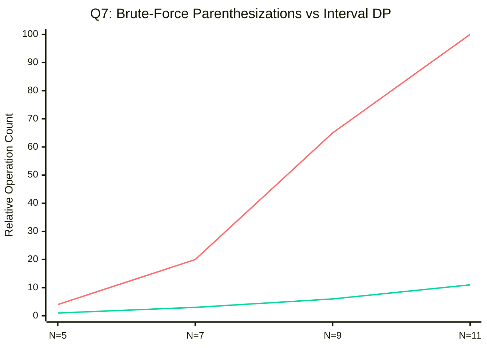

| Metric | Complexity |
|---|---|
| Time | `O(n³)` — `O(n²)` sub-ranges × `O(n)` split points each |
| Space | `O(n²)` — cost table plus split-point table |
| Brute-force baseline | Catalan-number growth, `Ω(4ⁿ/n^1.5)` |

---

## 📊 Complexity Landscape — All Seven Puzzles

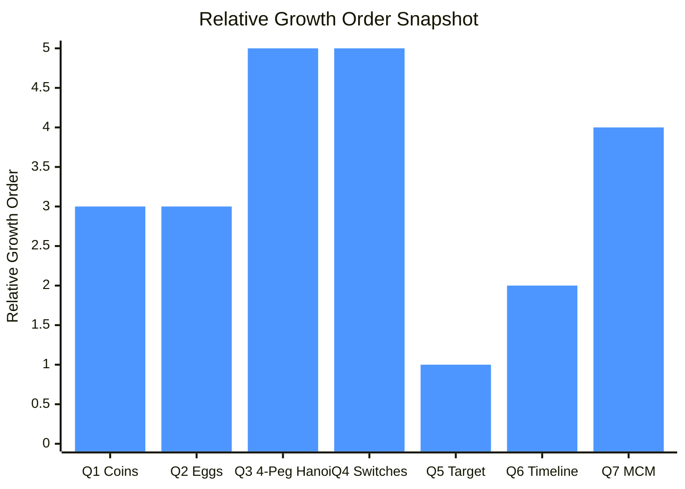

| Puzzle | Growth Signature | Family |
|---|---|---|
| 1️⃣ Coin-Triangle | 🟡 `Θ(n²)` moves | Combinatorial matching |
| 2️⃣ Egg Testing | 🟡 `O(E·F)` | Dynamic Programming |
| 3️⃣ Reve's Puzzle | 🔴 `Θ(2^√(2n))` moves | Frame–Stewart recursion |
| 4️⃣ Security Switches | 🔴 `Θ(2ⁿ)` moves | Gray-code recursion |
| 5️⃣ Moving Target | 🟢 `O(n)` shots | Parity sweep |
| 6️⃣ Best Time Alive | 🟡 `O(n log n)` | Event sweep |
| 7️⃣ MCM | 🟡 `O(n³)` | Interval DP |

---

## 🛠️ Tech Stack

<div align="center">

</div>

<div align="center">


</div>

---

## ✅ Key Takeaways

- 🪙 **Overlap-and-match beats brute force.** The coin-triangle puzzle looks geometric, but the minimum-move answer falls straight out of comparing two overlaid configurations.
- 🥚 **The egg-drop problem is the textbook example of DP state design** — the state `(eggs, floors)` shrinks in two different directions depending on the outcome of a single trial.
- 🗼🔐 **Hanoi-style recursion shows up in disguise.** Both the 4-peg Reve's puzzle and the security-switches puzzle reduce to "solve a smaller version twice, plus a constant," giving exponential (or sub-exponential) move counts.
- 🎯 **Parity arguments turn "impossible-seeming" problems solvable.** Not knowing the target's exact position doesn't matter if you can sweep through every parity class it could possibly be in.
- 📜 **Event sweeps are a recurring superpower.** The same birth/death sweep technique from this lab is identical in shape to interval-overlap problems from earlier labs — one pattern, many disguises.

---

## 🗂️ Repository Structure

```
Lab-07/
│
├── 📁 outputs/
│   ├── 🖼️ output-01.png   # Output — Invert the Coin-Triangle
│   ├── 🖼️ output-02.png   # Output — Super Egg Testing Experiment
│   ├── 🖼️ output-03.png   # Output — Reve's Puzzle (4-Peg Hanoi)
│   ├── 🖼️ output-04.png   # Output — Security Switches
│   ├── 🖼️ output-05.png   # Output — Hitting a Moving Target
│   ├── 🖼️ output-06.png   # Output — The Best Time to Be Alive
│   └── 🖼️ output-07.png   # Output — Matrix Chain Multiplication
│
├── 🇨 prog1.c             # Q1 · Invert the Coin-Triangle    → Θ(n²) moves
├── 🇨 prog2.c             # Q2 · Super Egg Testing           → O(E·F)
├── 🇨 prog3.c             # Q3 · Reve's Puzzle (4-Peg Hanoi) → Θ(2^√(2n)) moves
├── 🇨 prog4.c             # Q4 · Security Switches           → Θ(2ⁿ) moves
├── 🇨 prog5.c             # Q5 · Hitting a Moving Target     → O(n) shots
├── 🇨 prog6.c             # Q6 · The Best Time to Be Alive   → O(n log n)
├── 🇨 prog7.c             # Q7 · Matrix Chain Multiplication → O(n³)
└── 📘 README.md           # You are here
```

| Program File | Problem Solved | Output |
|---|---|---|
| `prog1.c` | Invert the Coin-Triangle | `outputs/output-01.png` |
| `prog2.c` | Super Egg Testing Experiment | `outputs/output-02.png` |
| `prog3.c` | Reve's Puzzle (4-Peg Hanoi) | `outputs/output-03.png` |
| `prog4.c` | Security Switches | `outputs/output-04.png` |
| `prog5.c` | Hitting a Moving Target | `outputs/output-05.png` |
| `prog6.c` | The Best Time to Be Alive | `outputs/output-06.png` |
| `prog7.c` | Matrix Chain Multiplication (MCM) | `outputs/output-07.png` |

### ⚡ Build & Run

```bash
# Compile any program (example: prog1.c)
gcc prog1.c -o prog1

# Run it
./prog1        # Linux / macOS
prog1.exe      # Windows
```

> Repeat for `prog2.c` → `prog7.c`. `prog2.c` and `prog7.c` take numeric inputs (eggs/floors, matrix dimensions); `prog1.c`, `prog3.c`, and `prog4.c` take a row/disk/switch count `n`; `prog5.c` and `prog6.c` take a spot count or a list of birth/death years as described in each problem section above.

---

<div align="center">


**Made with 🧠 + ☕ for DAA Lab-07 · IIIT Bhubaneswar**

</div>