<div align="center">


</div>

---

## 📌 Lab Metadata

| Field | Detail |
|---|---|
| 🧪 **Lab No.** | 08 |
| 📘 **Course** | Design and Analysis of Algorithm (DAA) |
| 🎓 **Program** | BTech (CS-B and CE), 3rd Semester |
| 📅 **Date** | September 29, 2026 |
| 👨‍🏫 **Instructor** | Dr. Ajaya Kumar Dash |
| 🎯 **Theme** | The Dynamic Programming design paradigm — 8 classic DP problems plus one legendary open problem |

---

## 🧠 Core Idea Behind This Lab

> Every problem below (except the last) shares one DNA strand: **optimal substructure** — the best answer to the whole problem is built from the best answers to smaller pieces of it — combined with **overlapping subproblems**, meaning naive recursion would solve the exact same piece again and again. DP's entire trick is a memory: *solve once, store it, reuse it.*

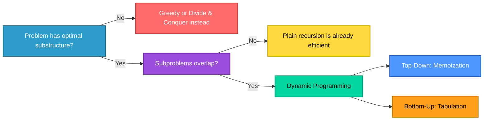

---

## 📂 Problem Index

| # | Problem | DP State | Complexity |
|---|---------|----------|------------|
| 1 | [Minimum Coin Change](#1--minimum-coin-change) | `dp[amount]` | `O(n·V)` |
| 2 | [Coin Change — Total Ways](#2--coin-change-total-number-of-ways) | `dp[coin][amount]` | `O(n·V)` |
| 3 | [Longest Common Subsequence](#3--longest-common-subsequence-lcs) | `dp[i][j]` over both strings | `O(m·n)` |
| 4 | [Longest Increasing Subsequence](#4--longest-increasing-subsequence) | `dp[i]` = LIS ending at `i` | `O(n²)` → `O(n log n)` |
| 5 | [Maximum Sum Increasing Subsequence](#5--maximum-sum-increasing-subsequence) | `dp[i]` = best sum ending at `i` | `O(n²)` |
| 6 | [Edit Distance with Traceback](#6--edit-distance-with-traceback-information) | `dp[i][j]` over both strings | `O(m·n)` |
| 7 | [Rod Cutting with Reconstruction](#7--rod-cutting-with-reconstruction) | `dp[length]` | `O(n²)` |
| 8 | [Optimal Binary Search Trees](#8--optimal-binary-search-trees-obst) | `dp[i][j]` over key ranges | `O(n³)` |
| 9 | [Collatz Conjecture](#9--collatz-conjecture-open-unsolved-problem) | *(not DP — open problem)* | Unbounded / unproven |

---

<div align="center">

</div>

## 1. 🪙 Minimum Coin Change

**Problem:** Given coin denominations `C` and target amount `V`, find the **minimum number of coins** to make `V` (infinite supply of each coin), or `-1` if impossible.

**Approach:** `dp[v]` = minimum coins to make amount `v`. For each amount, try every coin and take the best.

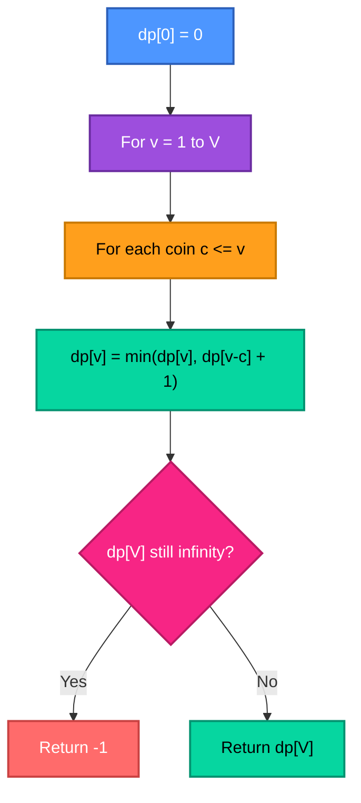

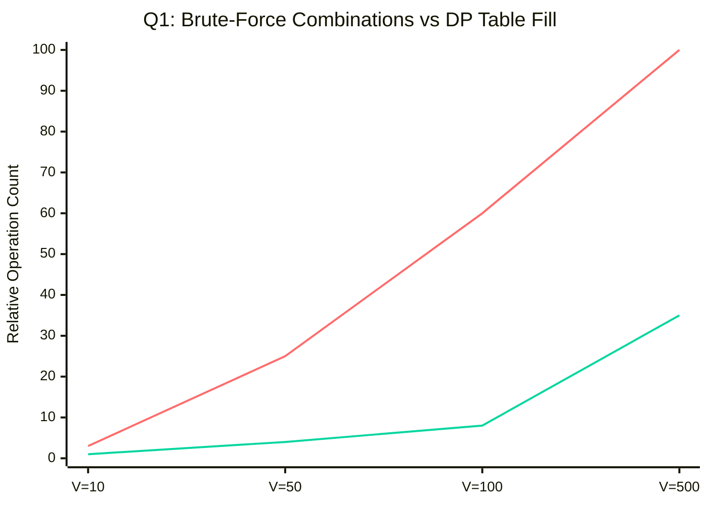

| Metric | Complexity |
|---|---|
| Time | `O(n·V)` — `V` amounts × `n` coins each |
| Space | `O(V)` — one array indexed by amount |

---

## 2. 🔢 Coin Change: Total Number of Ways

**Problem:** Count the **total distinct combinations** of coins summing to `V` (order doesn't matter).

**Approach:** The key difference from Q1 — iterate coins in the **outer** loop so each combination is counted once, not once per ordering.

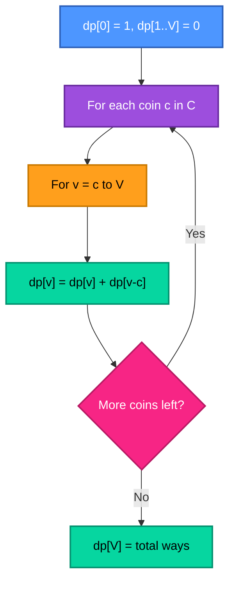

| Metric | Complexity |
|---|---|
| Time | `O(n·V)` | 
| Space | `O(V)` |

> ⚠️ **Loop order matters here!** Swapping the two loops (amount outer, coin inner) would count permutations instead of combinations — a classic DP gotcha worth noting in your program comments.

---

<div align="center">

</div>

## 3. 🧬 Longest Common Subsequence (LCS)

**Problem:** Given sequences `X` (length `m`) and `Y` (length `n`), find the length of their LCS and reconstruct it.

**Approach:** `dp[i][j]` = LCS length of `X[1..i]` and `Y[1..j]`. Matching characters extend the diagonal; mismatches take the best of two neighbors.

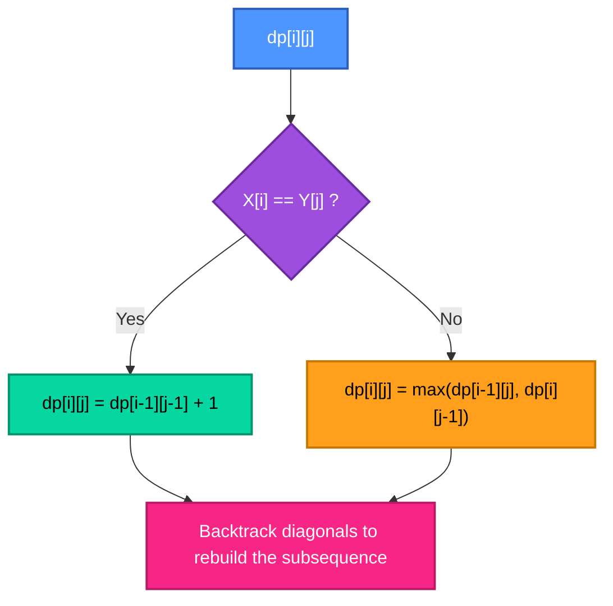

| Metric | Complexity |
|---|---|
| Time | `O(m·n)` |
| Space | `O(m·n)` — full table needed for backtracking/reconstruction |

---

## 4. 📈 Longest Increasing Subsequence

**Problem:** Find the length of the longest strictly increasing subsequence in array `A`.

**Approach — Two levels of sophistication:**

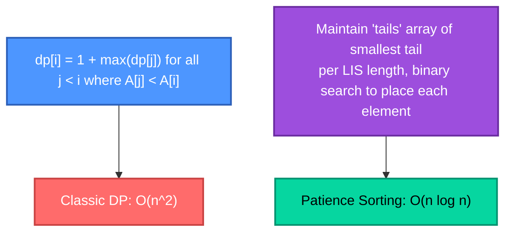

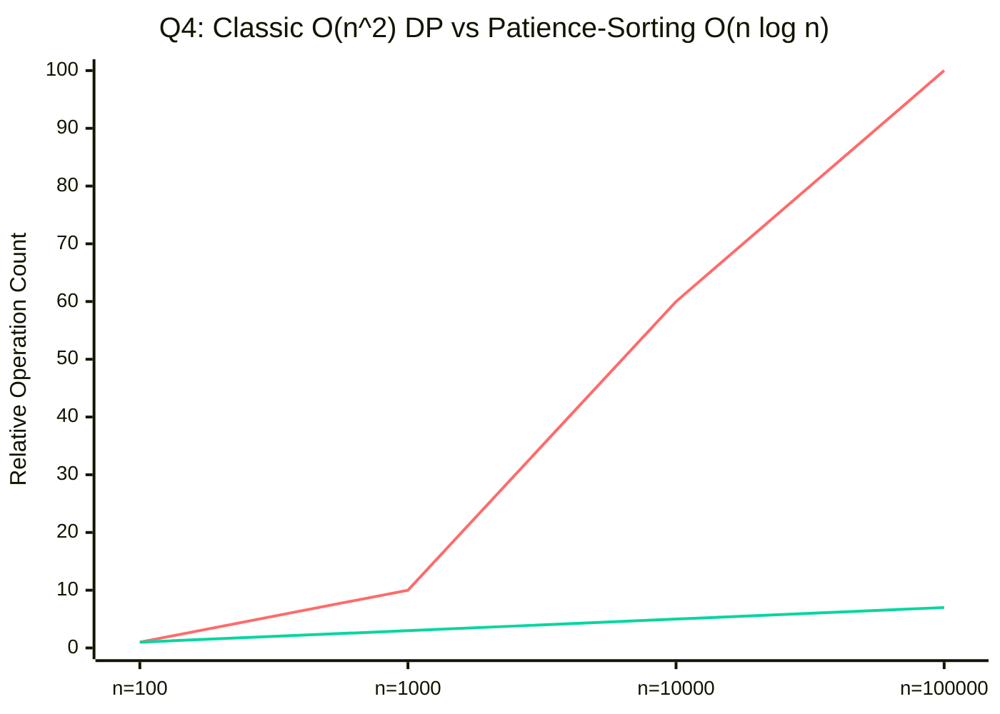

| Approach | Time | Space |
|---|---|---|
| Classic DP | `O(n²)` | `O(n)` |
| Patience sorting + binary search | `O(n log n)` | `O(n)` |

---

## 5. 💰 Maximum Sum Increasing Subsequence

**Problem:** Find the maximum possible **sum** of a strictly increasing subsequence (not just the longest length).

**Approach:** Nearly identical structure to Q4, but the DP tracks accumulated sum instead of length.

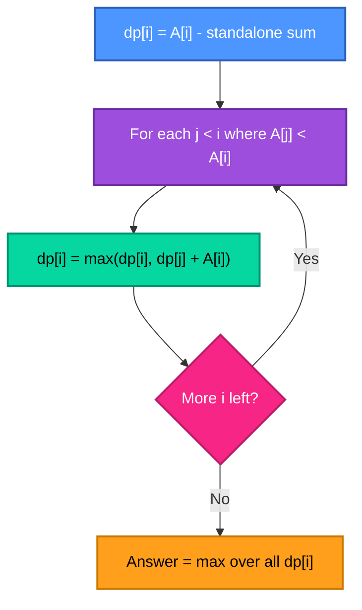

| Metric | Complexity |
|---|---|
| Time | `O(n²)` |
| Space | `O(n)` |

---

<div align="center">

</div>

## 6. ✏️ Edit Distance with Traceback Information

**Problem:** Minimum insertions/deletions/substitutions to transform string `A` (length `m`) into `B` (length `n`), with the traceback path printed.

**Approach:** `dp[i][j]` = edit distance between `A[1..i]` and `B[1..j]`. Matching characters cost nothing; mismatches take the cheapest of insert, delete, or substitute.

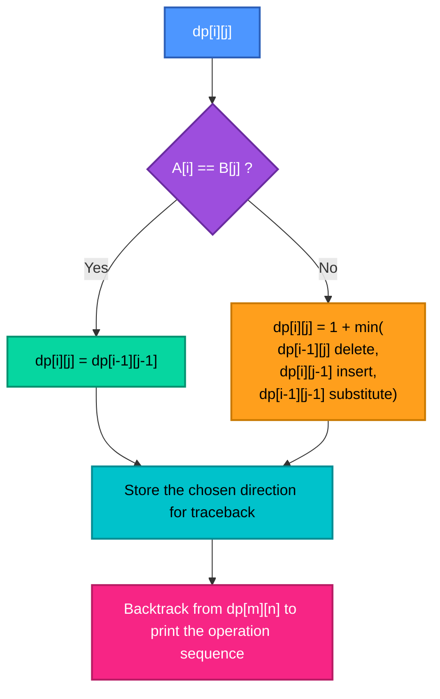

| Metric | Complexity |
|---|---|
| Time | `O(m·n)` |
| Space | `O(m·n)` — needed to reconstruct the traceback path |

---

## 7. 🪵 Rod Cutting with Reconstruction

**Problem:** Given rod length `n` and price array `P`, find the maximum revenue from cutting the rod into pieces, **and** the exact lengths used.

**Approach:** `dp[len]` = best revenue for a rod of length `len`. Try every first-cut length and recurse on the remainder; store the chosen first cut for reconstruction.

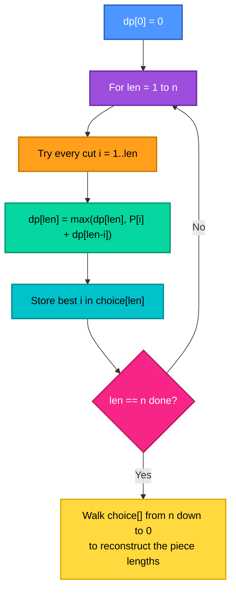

| Metric | Complexity |
|---|---|
| Time | `O(n²)` — `n` lengths × up to `n` cut choices each |
| Space | `O(n)` for `dp[]`, plus `O(n)` for the choice/reconstruction array |

---

## 8. 🌳 Optimal Binary Search Trees (OBST)

**Problem:** Given `n` sorted keys with search probabilities and `n+1` dummy-key probabilities, build the BST that **minimizes expected search cost**.

**Approach — Interval DP:** `dp[i][j]` = minimum expected cost of a tree containing keys `i` through `j`. Try every key in the range as the root; add the cost of the subtree plus the total probability weight of the range (since every node's depth increases by one when it's not the root).

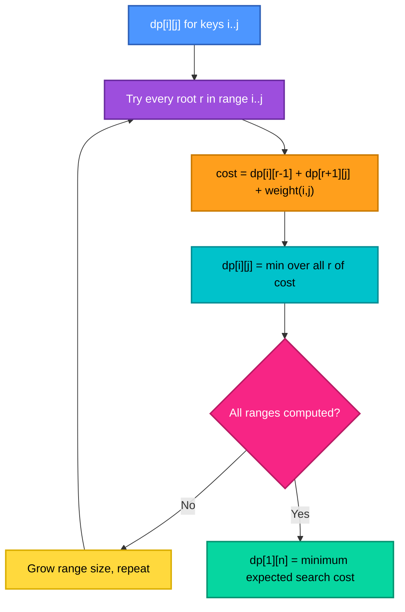

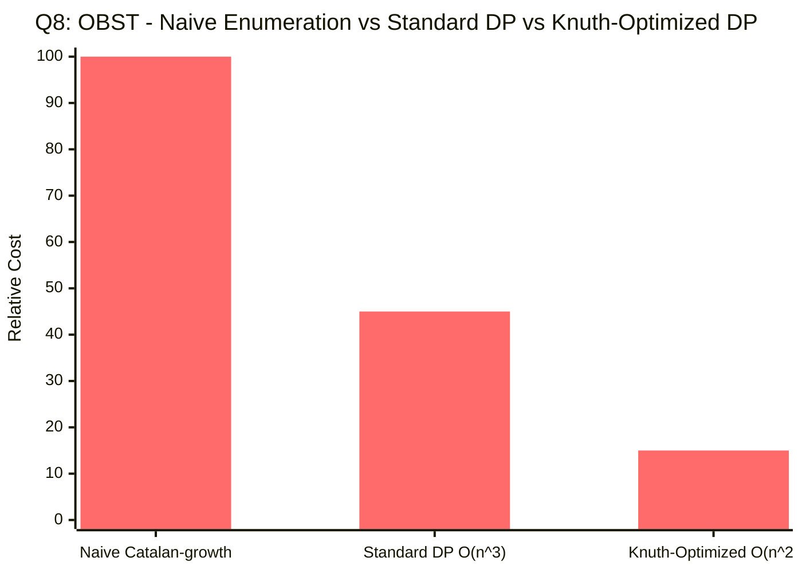

| Metric | Complexity |
|---|---|
| Time (standard interval DP) | `O(n³)` — `O(n²)` ranges × `O(n)` root choices each |
| Time (Knuth's optimization) | `O(n²)` — exploits monotonicity of optimal root choice |
| Space | `O(n²)` |

---

<div align="center">

</div>

## 9. 🌀 Collatz Conjecture (Open, Unsolved Problem)

**The recurrence:**

```
        ⎧ n / 2        if n is even
T(n)  = ⎨
        ⎩ 3n + 1       if n is odd
```

Repeatedly apply `T` starting from any positive integer `n` — conjectured (but **unproven**) to always eventually reach `1`.

> 🔓 This one isn't a DP problem at all — there's no optimal substructure to exploit, because nobody has proven the recursion even *terminates* for every input. It's included here as a C-programming exercise in iteration, pointers/dynamic memory, and integer-overflow handling, and as a reminder that **"simple to state" ≠ "simple to solve."**

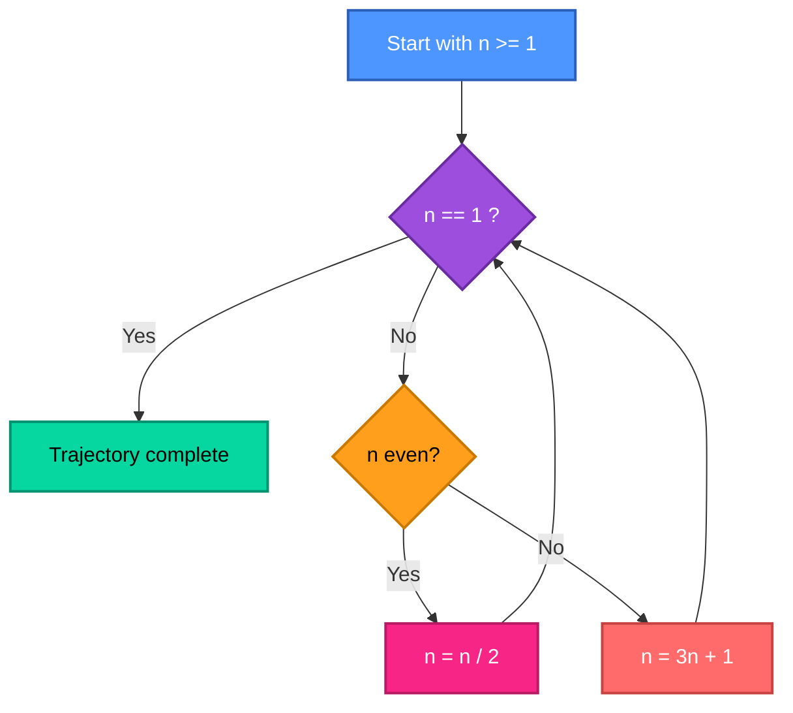

**Example trajectory — `n = 27`:** one of the most famous small starting values, taking **111 steps** and spiking to a peak value of **9,232** before collapsing to 1 — a striking illustration of how "simple rules" can produce wildly chaotic-looking behavior.

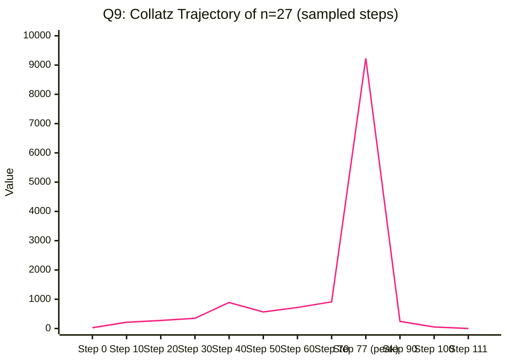

| Metric | Status |
|---|---|
| Termination for all `n ≥ 1` | ❓ **Unproven** — verified computationally for enormous ranges, never proven in general |
| Worst-case trajectory length | **Unbounded / unknown** — no closed-form bound exists |
| Per-step cost | `O(1)` arithmetic, but **total steps is not polynomially bounded** by any known function of `n` |
| Programming focus | Iteration, modular functions, pointers/dynamic arrays to store trajectories, `long`/`unsigned long long` to guard against overflow on the `3n+1` branch |

---

## 📊 Complexity Landscape — Problems 1 to 8

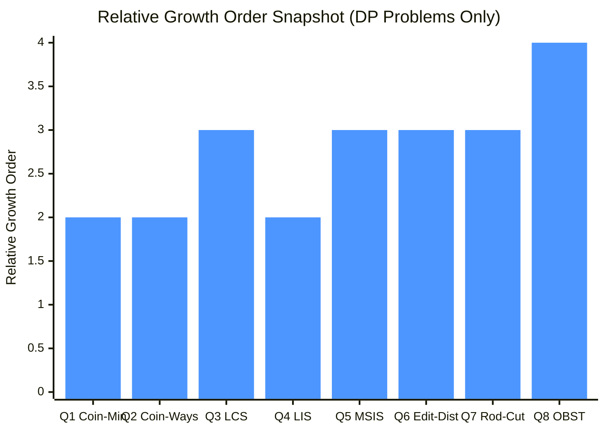

| Problem | Complexity | DP Shape |
|---|---|---|
| 1️⃣ Minimum Coin Change | 🟡 `O(n·V)` | 1D table |
| 2️⃣ Coin Change — Ways | 🟡 `O(n·V)` | 1D table, careful loop order |
| 3️⃣ LCS | 🟠 `O(m·n)` | 2D table |
| 4️⃣ LIS | 🟡 `O(n²)` → `O(n log n)` | 1D table (or binary search) |
| 5️⃣ Max Sum IS | 🟠 `O(n²)` | 1D table |
| 6️⃣ Edit Distance | 🟠 `O(m·n)` | 2D table |
| 7️⃣ Rod Cutting | 🟠 `O(n²)` | 1D table |
| 8️⃣ OBST | 🔴 `O(n³)` → `O(n²)` | 2D interval table |

---

## 🛠️ Tech Stack

<div align="center">

</div>

<div align="center">


</div>

---

## ✅ Key Takeaways

- 🪙 **1D vs 2D DP is about how many "things" are changing.** Coin-change and rod-cutting track one shrinking quantity (amount, length) — LCS and Edit Distance track two independent sequences at once, hence the 2D table.
- 🔁 **Loop order can silently change the answer.** Q1 and Q2 use almost identical recurrences, but swapping which loop is outer turns "combinations" into "permutations" — a subtle, easy-to-miss bug worth testing for explicitly.
- 📈 **The same problem can have two correct complexities.** LIS's `O(n²)` DP and `O(n log n)` patience-sorting approach compute the *same answer* — the second just recognizes extra structure (sorted "tails") that the first throws away.
- 🌳 **Interval DP (OBST) generalizes the "try every split point" pattern** seen in Matrix Chain Multiplication from the previous lab — same shape, different cost function.
- 🌀 **Not everything is Dynamic Programming.** The Collatz Conjecture closes the lab on purpose — a reminder that some recurrences have no known optimal substructure, no proof of termination, and no polynomial bound, however simple they look on paper.

---

## 🗂️ Repository Structure

```
Lab-08/
│
├── 📁 Outputs/
│   ├── 🖼️ prog1.png   # Output — Minimum Coin Change
│   ├── 🖼️ prog2.png   # Output — Coin Change: Total Ways
│   ├── 🖼️ prog3.png   # Output — Longest Common Subsequence
│   ├── 🖼️ prog4.png   # Output — Longest Increasing Subsequence
│   ├── 🖼️ prog5.png   # Output — Maximum Sum Increasing Subsequence
│   ├── 🖼️ prog6.png   # Output — Edit Distance with Traceback
│   ├── 🖼️ prog7.png   # Output — Rod Cutting with Reconstruction
│   ├── 🖼️ prog8.png   # Output — Optimal Binary Search Trees
│   └── 🖼️ prog9.png   # Output — Collatz Conjecture
│
├── 🇨 prog1.c           # Q1 · Minimum Coin Change            → O(n·V)
├── 🇨 prog2.c           # Q2 · Coin Change: Total Ways        → O(n·V)
├── 🇨 prog3.c           # Q3 · Longest Common Subsequence     → O(m·n)
├── 🇨 prog4.c           # Q4 · Longest Increasing Subsequence → O(n²) / O(n log n)
├── 🇨 prog5.c           # Q5 · Max Sum Increasing Subsequence → O(n²)
├── 🇨 prog6.c           # Q6 · Edit Distance with Traceback   → O(m·n)
├── 🇨 prog7.c           # Q7 · Rod Cutting with Reconstruction→ O(n²)
├── 🇨 prog8.c           # Q8 · Optimal Binary Search Trees    → O(n³)
├── 🇨 prog9.c           # Q9 · Collatz Conjecture              → Unbounded / unproven
└── 📘 README.md         # You are here
```

| Program File | Problem Solved | Output |
|---|---|---|
| `prog1.c` | Minimum Coin Change | `Outputs/prog1.png` |
| `prog2.c` | Coin Change: Total Number of Ways | `Outputs/prog2.png` |
| `prog3.c` | Longest Common Subsequence (LCS) | `Outputs/prog3.png` |
| `prog4.c` | Longest Increasing Subsequence | `Outputs/prog4.png` |
| `prog5.c` | Maximum Sum Increasing Subsequence | `Outputs/prog5.png` |
| `prog6.c` | Edit Distance with Traceback Information | `Outputs/prog6.png` |
| `prog7.c` | Rod Cutting with Reconstruction | `Outputs/prog7.png` |
| `prog8.c` | Optimal Binary Search Trees (OBST) | `Outputs/prog8.png` |
| `prog9.c` | Collatz Conjecture | `Outputs/prog9.png` |

### ⚡ Build & Run

```bash
# Compile any program (example: prog1.c)
gcc prog1.c -o prog1

# Run it
./prog1        # Linux / macOS
prog1.exe      # Windows
```

> Repeat for `prog2.c` → `prog9.c`. `prog3.c` and `prog6.c` take two input strings; `prog8.c` takes keys with search probabilities; `prog9.c` takes a starting value `n` and an interval `[a, b]` to analyse, per the problem statement.

---

<div align="center">


**Made with 🧠 + ☕ for DAA Lab-08 · IIIT Bhubaneswar**

</div>