<div align="center">


</div>

---

## 📌 Lab Metadata

| Field | Detail |
|---|---|
| 🧪 **Lab No.** | 09 |
| 📘 **Course** | Design and Analysis of Algorithm (DAA) |
| 🎓 **Program** | BTech (CS-B and CE), 3rd Semester |
| 📅 **Date** | October 6, 2026 |
| 👨‍🏫 **Instructor** | Dr. Ajaya Kumar Dash |
| 🎯 **Theme** | Greedy design paradigm — 9 medium-to-hard problems plus one open research question |

---

## 🧠 Core Idea Behind This Lab

> A greedy algorithm commits to the **locally best choice at every step** and never revisits it. It only works when two properties hold: the **greedy-choice property** (a locally optimal pick can be extended to a globally optimal solution) and **optimal substructure**. Proving those properties — usually with an *exchange argument* — is the real work; the code is often just a sort or a heap.

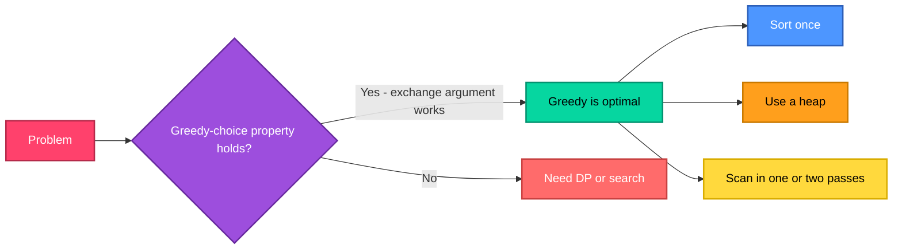

---

## 📂 Problem Index

| # | Problem | Greedy Tool | Complexity |
|---|---------|-------------|------------|
| 1 | [Fractional Knapsack with Deterioration](#1--fractional-knapsack-with-deterioration-rate) | Best current value density | `O(n log n)` – `O(n²)`* |
| 2 | [Huffman Coding](#2--huffman-coding-canonical-codebook) | Min-heap merge of two rarest | `O(n log n)` |
| 3 | [Minimum Refuelling Stops](#3--minimum-initial-fuel-reverse-greedy) | Max-heap of passed stations | `O(n log n)` |
| 4 | [Connect Sticks](#4--minimum-cost-to-connect-sticks) | Min-heap, merge two smallest | `O(n log n)` |
| 5 | [Candy Distribution](#5--candy-distribution-bi-directional-slope-greedy) | Left pass + right pass | `O(n)` |
| 6 | [Reorganise String, K Apart](#6--reorganise-string-with-k-distance-apart) | Max-heap + cooldown queue | `O(N log A)` |
| 7 | [Minimise Deviation](#7--minimise-deviation-in-array) | Max-heap, shrink the largest | `O(n log n · log M)` |
| 8 | [Minimum Meeting Rooms](#8--minimum-number-of-meeting-rooms) | Sort + min-heap of end times | `O(n log n)` |
| 9 | [Hu-Tucker Simulation](#9--hu-tucker-greedy-simulation) | Merge cheapest compatible pair | `O(n log n)` – `O(n²)`* |
| 10 | [Greedy Superstring Conjecture](#10--greedy-superstring-conjecture-open-problem) | Merge max-overlap pair | NP-hard exact · polynomial heuristic |

<sub>* Depends on implementation — see the individual sections.</sub>

---

<div align="center">

</div>

## 1. 🎒 Fractional Knapsack with Deterioration Rate

**Problem:** `n` items with value `vᵢ`, weight `wᵢ`, and decay rate `λᵢ > 0`. An item consumed at time `t` has effective density `(vᵢ/wᵢ) − λᵢ·t`. Choose the consumption order and fractions to maximise total value within capacity `W`.

**Approach:** The classic fractional knapsack is greedy by density. Here density *drifts with time*, so the greedy rule becomes **"always take the item whose current effective density is highest"**, re-evaluated as time advances, taking fractions until the knapsack is full or densities turn non-positive (those items add no value and are skipped).

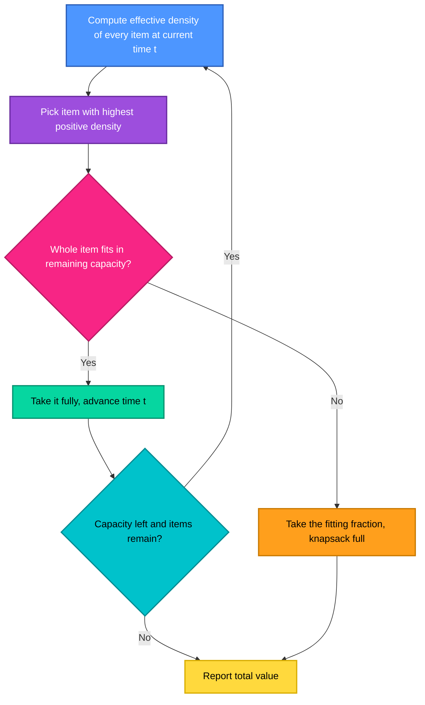

| Strategy | Time | Space |
|---|---|---|
| Re-scan all items for the best density each step | `O(n²)` | `O(1)` extra |
| Sort by a fixed key when the order is static | `O(n log n)` | `O(1)` extra |

> 🔎 Because decay is linear in `t`, two items' density lines can cross, so a single up-front sort is only valid when the ordering cannot change — the re-evaluating version is the safe general form.

---

## 2. 🌲 Huffman Coding (Canonical Codebook)

**Problem:** Build a prefix-free binary code of minimum expected length from symbol frequencies, then output the **canonical** codebook (codes ordered by length, then lexicographically).

**Approach:** Repeatedly extract the two lowest-frequency nodes from a min-heap, merge them under a new parent whose frequency is their sum, and push it back. Code *lengths* come from node depths; the *canonical* codes are then assigned by sorting symbols by (length, symbol) and counting upward in binary.

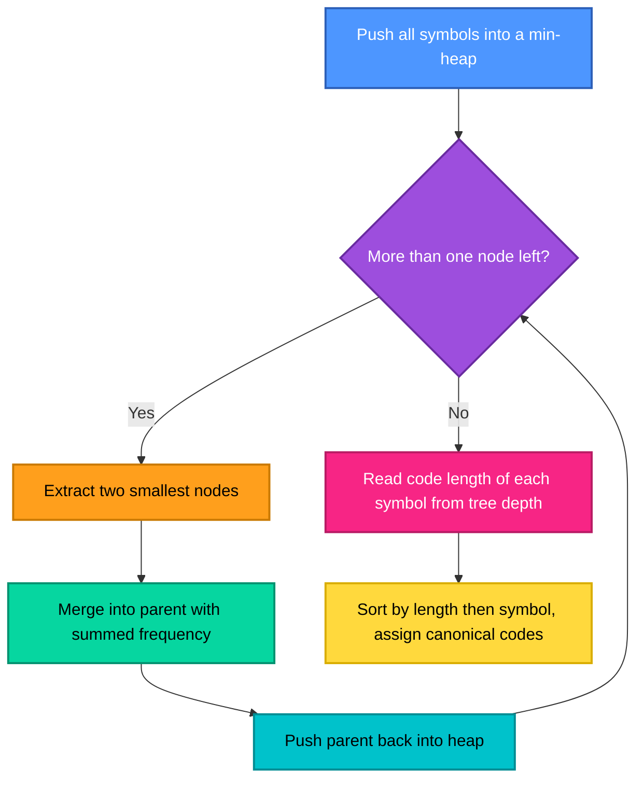

**Worked example** (frequencies `a:5, b:9, c:12, d:13, e:16, f:45`):

| Symbol | Frequency | Code length | Canonical code |
|---|---|---|---|
| f | 45 | 1 | `0` |
| c | 12 | 3 | `100` |
| d | 13 | 3 | `101` |
| e | 16 | 3 | `110` |
| a | 5 | 4 | `1110` |
| b | 9 | 4 | `1111` |

Expected length = `224 / 100 = 2.24` bits per symbol, versus `3` bits for a fixed-length code.

| Metric | Complexity |
|---|---|
| Heap-based tree construction | `O(n log n)` — `n−1` merges, each `O(log n)` |
| Canonical code assignment | `O(n log n)` — dominated by the sort |
| Space | `O(n)` |

---

## 3. ⛽ Minimum Initial Fuel (Reverse Greedy)

**Problem:** Reach target distance `D` starting with fuel `F`; stations `(dᵢ, fᵢ)` refuel the vehicle. Find the **minimum number of refuelling stops**.

**Approach — "Decide later" greedy:** Drive as far as the current fuel allows, *remembering* every station passed in a **max-heap of refuel amounts**. When fuel runs out before the target, retroactively "stop" at the passed station with the largest refuel. If the heap is empty and the target is still out of range, it is unreachable.

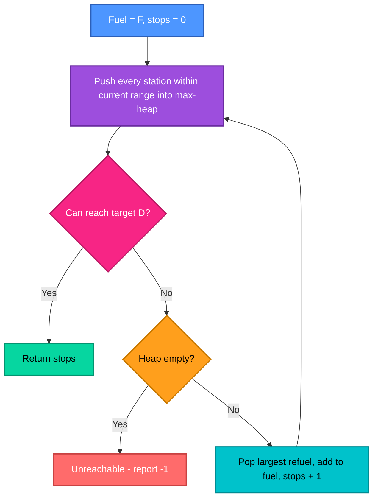

| Metric | Complexity |
|---|---|
| Time | `O(n log n)` — each station is pushed and popped at most once |
| Space | `O(n)` for the heap |

---

<div align="center">

</div>

## 4. 🪢 Minimum Cost to Connect Sticks

**Problem:** Joining sticks of length `x` and `y` costs `x + y`. Minimise the total cost of joining all `n` sticks into one.

**Approach:** Always join the **two shortest** sticks — short sticks get re-added into later joins, so they should be paid for as few times as possible. This is structurally identical to Huffman's merge step.

**Worked example:** sticks `{2, 3, 4}` → join `2+3 = 5` (cost 5), then `5+4 = 9` (cost 9) → **total 14**.

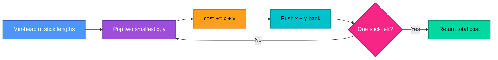

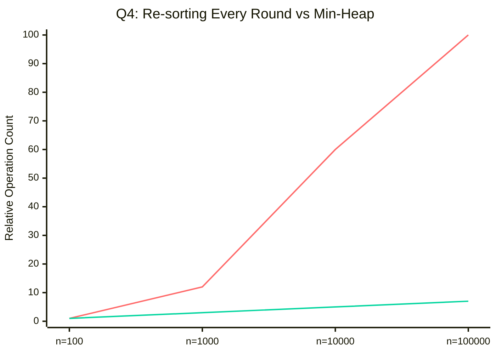

| Approach | Time |
|---|---|
| Re-sort after every merge | `O(n² log n)` |
| Min-heap | `O(n log n)` |
| Space | `O(n)` |

---

## 5. 🍬 Candy Distribution (Bi-directional Slope Greedy)

**Problem:** Children in a line each have a rating. Everyone gets at least 1 candy, and a child with a higher rating than a neighbour must get more candies than that neighbour. Minimise total candies.

**Approach:** The constraint has a *left* part and a *right* part, and trying to satisfy both at once is messy. Satisfy them **independently**: a left-to-right pass (higher than left neighbour → left + 1), then a right-to-left pass (higher than right neighbour → take the max of the current value and right + 1).

**Worked example:** ratings `{1, 0, 2}` → candies `{2, 1, 2}` → **total 5**.

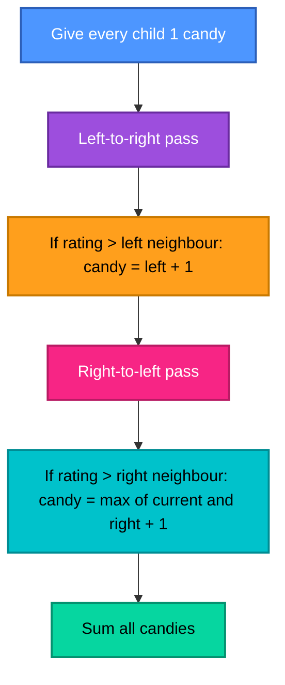

| Metric | Complexity |
|---|---|
| Time | `O(n)` — two linear passes |
| Space | `O(n)` for the candy array (an `O(1)` slope-counting variant exists) |

---

## 6. 🔤 Reorganise String with K-Distance Apart

**Problem:** Rearrange string `S` so equal characters are at least `K` positions apart, or report impossible.

**Approach:** Count character frequencies, keep a **max-heap by remaining frequency**, and at each position place the most frequent character that is *not* on cooldown. A placed character waits in a queue for `K` positions before it may re-enter the heap. If the heap is empty while characters remain, no valid arrangement exists.

**Worked example:** `aabbcc`, `K = 3` → `abcabc`.

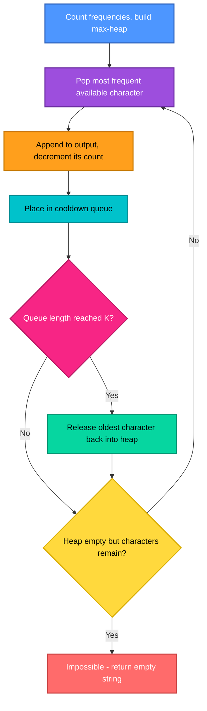

| Metric | Complexity |
|---|---|
| Time | `O(N log A)` — `N` = string length, `A` = alphabet size (effectively `O(N)` for a fixed alphabet) |
| Space | `O(A + K)` |

---

<div align="center">

</div>

## 7. 📉 Minimise Deviation in Array

**Problem:** You may multiply an odd element by 2 or halve an even element, any number of times. Minimise `max(A) − min(A)`.

**Approach — turn a two-way problem into a one-way one:** Multiplying odds by 2 is a one-time move (the result is even and can only then be halved). So first **double every odd element** — now every element sits at its maximum possible value and the only remaining move is *halving*. Then greedily halve the current maximum (max-heap) while it is even, tracking the smallest deviation seen; stop when the maximum is odd.

**Worked example:** `{1, 2, 3, 4}` → deviation **1**.

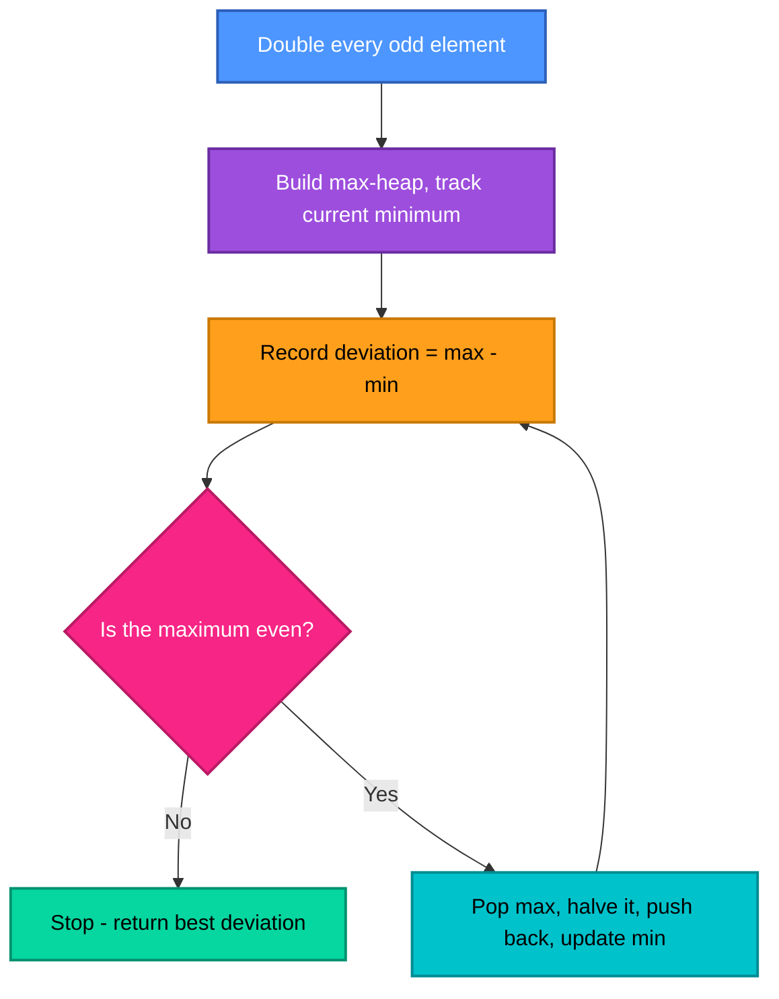

| Metric | Complexity |
|---|---|
| Time | `O(n log n · log M)` — each element can be halved at most `log M` times (`M` = max value), each heap operation `O(log n)` |
| Space | `O(n)` |

---

## 8. 🏢 Minimum Number of Meeting Rooms

**Problem:** Given meeting intervals `[sᵢ, eᵢ]`, find the minimum number of rooms so no two overlapping meetings share one.

**Approach:** Sort meetings by start time and keep a **min-heap of end times** (one entry per room in use). For each meeting, if the earliest-ending room is already free, reuse it; otherwise open a new room. The heap size at the end is the answer.

**Worked example:** `[0,30], [5,10], [15,20]` → **2 rooms**.

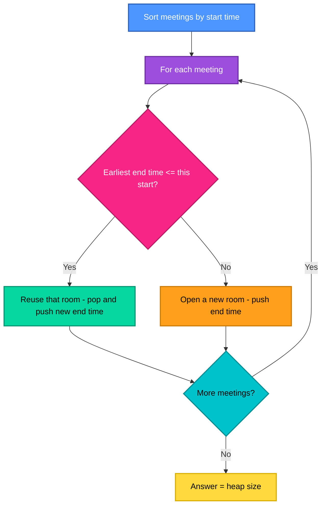

| Approach | Time | Space |
|---|---|---|
| Sort + min-heap of end times | `O(n log n)` | `O(n)` |
| Sort starts and ends separately, two pointers | `O(n log n)` | `O(n)` |
| Check every pair for overlap (naive) | `O(n²)` | `O(1)` |

> 🔁 Same sweep idea as the party-attendance and interval-overlap problems from earlier labs — the minimum rooms equals the **maximum number of simultaneously active meetings**.

---

## 9. 🔗 Hu-Tucker Greedy Simulation

**Problem:** Given weights `w₁ … wₙ` in a fixed order, build an optimal **alphabetic** binary tree — leaves must stay in the original left-to-right order — minimising `Σ wᵢ · depth(i)`.

**Why it is harder than Huffman:** Huffman may merge *any* two smallest nodes. Here, merging two nodes with another leaf stuck between them would break the in-order sequence. Hu-Tucker handles this by merging the cheapest **compatible pair** (no leaf between them), then rebuilding the tree in the correct order.

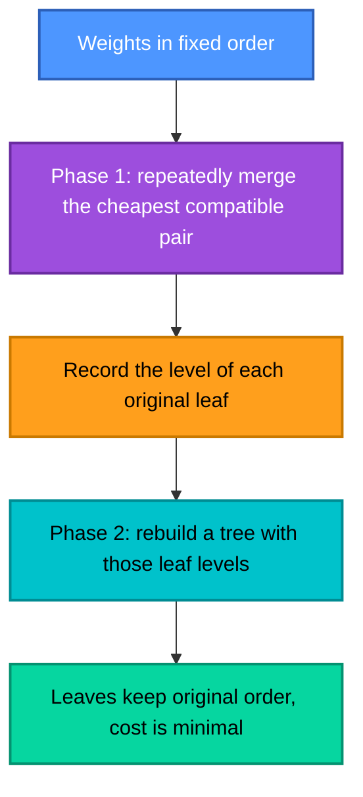

| Implementation | Time |
|---|---|
| Straightforward simulation (scan for the best compatible pair each round) | `O(n²)` |
| Full Hu-Tucker with an efficient data structure | `O(n log n)` |
| Space | `O(n)` |

---

<div align="center">

</div>

## 10. 🧵 Greedy Superstring Conjecture (Open Problem)

**Problem:** Given `n` strings, find the **shortest string containing every one of them as a substring**. This is NP-hard, so the classic approach is a *greedy heuristic*: repeatedly merge the pair of strings with the **maximum overlap**.

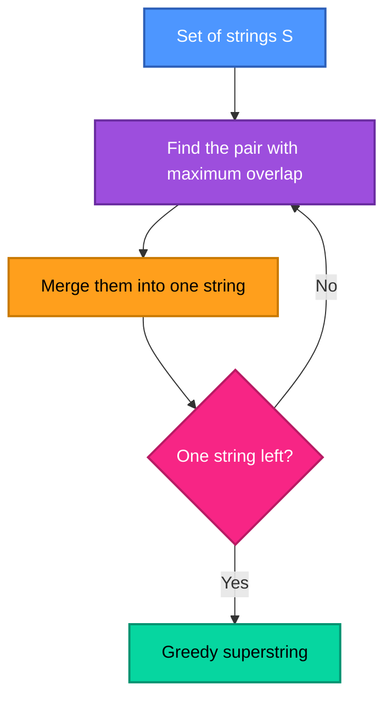

### 📜 Status of the conjecture (as described in the lab sheet)

| Item | Detail |
|---|---|
| **Conjecture** | Greedy always returns a superstring at most **2×** the optimal length (a 2-approximation) |
| **Age** | Formulated nearly four decades ago |
| **Reported September 2026 result** | An arXiv paper, *"Disproving the Greedy Superstring Conjecture"*, reports that for inputs with even string length `k ≥ 10` the ratio is at least `(9k + 2) / (4k + 4)`, approaching `9/4 = 2.25` as `k → ∞` |
| **Validation status** | ⚠️ **Not yet officially validated**, per the lab sheet |
| **Note** | The counterexample was reportedly found with AI assistance |

The reported lower bound, plotted against the conjectured ratio of 2:

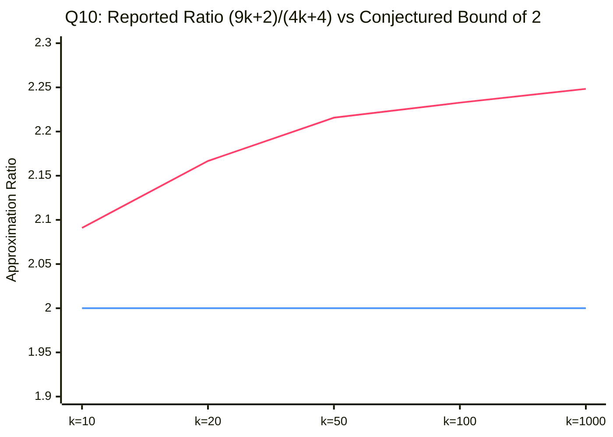

> 📈 Upper curve: the reported lower bound on greedy's ratio. Lower line: the conjectured bound of 2. If the result holds up, the curve sitting **above** the line is exactly what "disproved" means — but this is a very recent claim, so treat it as *reported*, not settled.

| Metric | Status |
|---|---|
| Exact shortest superstring | NP-hard |
| Greedy heuristic | Polynomial — the pairwise-overlap computation dominates (roughly quadratic in the number of strings, times string length) |
| Approximation guarantee of greedy | ❓ **Open** — the 2-approximation conjecture is under challenge |

---

## 📊 Complexity Landscape — Problems 1 to 9

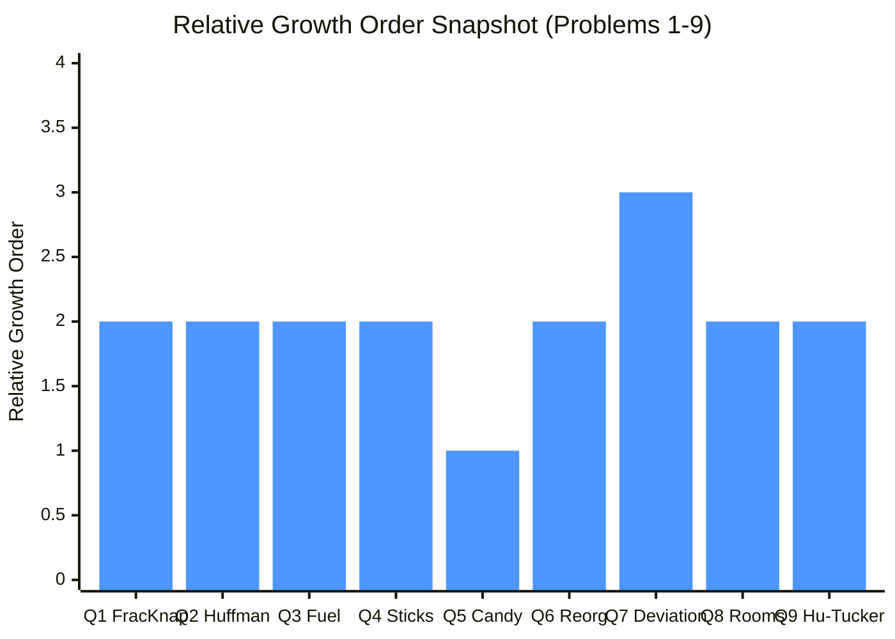

| Problem | Technique | Complexity |
|---|---|---|
| 1️⃣ Fractional Knapsack (decay) | Best current density | 🟡 `O(n log n)` – `O(n²)` |
| 2️⃣ Huffman | Min-heap merge | 🟡 `O(n log n)` |
| 3️⃣ Refuelling stops | Max-heap, retroactive choice | 🟡 `O(n log n)` |
| 4️⃣ Connect sticks | Min-heap merge | 🟡 `O(n log n)` |
| 5️⃣ Candy | Two linear passes | 🟢 `O(n)` |
| 6️⃣ Reorganise string | Max-heap + cooldown | 🟡 `O(N log A)` |
| 7️⃣ Minimise deviation | Max-heap, halving | 🟠 `O(n log n · log M)` |
| 8️⃣ Meeting rooms | Sort + min-heap | 🟡 `O(n log n)` |
| 9️⃣ Hu-Tucker | Compatible-pair merge | 🟡 `O(n log n)` – `O(n²)` |

<sub>Problem 10 is omitted from the chart: it has no single running time to compare — the exact problem is NP-hard and the open question is about approximation quality, not speed.</sub>

---

## 🛠️ Tech Stack

<div align="center">

</div>

<div align="center">


</div>

---

## ✅ Key Takeaways

- 🧮 **Heaps are the greedy workhorse.** Seven of the ten problems (Q2, Q3, Q4, Q6, Q7, Q8, Q9) reduce to "repeatedly grab the best available element" — exactly what a priority queue provides in `O(log n)`.
- 🪢 **Huffman, connect-sticks and Hu-Tucker are one family.** All merge items bottom-up; the only difference is *which* pairs are allowed to merge (any two, any two, or only compatible neighbours).
- ⏪ **Greedy can decide *later*.** The refuelling problem never commits to a stop in advance — it keeps the options in a heap and picks retroactively only when forced. Delaying the decision is what makes the greedy choice safe.
- ↔️ **Two simple passes beat one clever one.** Candy distribution splits a two-sided constraint into two one-sided passes, each trivially correct.
- 🔀 **Reformulate before you optimise.** Minimise-deviation becomes easy only after doubling every odd number turns a two-way operation into a one-way one.
- 🧵 **Greedy is not always provably good.** The superstring conjecture is the cautionary tale: a heuristic believed to be within 2× of optimal for decades is now reportedly challenged — a reminder that "works on every example" is not a proof.

---

## 🗂️ Repository Structure

```
Lab-09/
│
├── 📁 outputs/
│   └── 🖼️ Screenshot 20….png   # Output screenshots, one per program
│
├── 🇨 prog1.c              # Q1  · Fractional Knapsack with Deterioration
├── 🇨 prog2.c              # Q2  · Huffman Coding (canonical)          → O(n log n)
├── 🇨 prog3.c              # Q3  · Minimum Refuelling Stops            → O(n log n)
├── 🇨 prog4.c              # Q4  · Connect Sticks                      → O(n log n)
├── 🇨 prog5.c              # Q5  · Candy Distribution                  → O(n)
├── 🇨 prog6.c              # Q6  · Reorganise String, K Apart          → O(N log A)
├── 🇨 prog7.c              # Q7  · Minimise Deviation                  → O(n log n · log M)
├── 🇨 prog8.c              # Q8  · Minimum Meeting Rooms               → O(n log n)
├── 🇨 prog9.c              # Q9  · Hu-Tucker Simulation
├── 🇨 prog10.c             # Q10 · Greedy Superstring
└── 📘 README.md            # You are here
```

| Program File | Problem Solved |
|---|---|
| `prog1.c` | Fractional Knapsack with Deterioration Rate |
| `prog2.c` | Huffman Coding (Canonical Codebook) |
| `prog3.c` | Minimum Initial Fuel (Reverse Greedy) |
| `prog4.c` | Minimum Cost to Connect Sticks |
| `prog5.c` | Candy Distribution Problem |
| `prog6.c` | Reorganise String with K-Distance Apart |
| `prog7.c` | Minimise Deviation in Array |
| `prog8.c` | Minimum Number of Meeting Rooms |
| `prog9.c` | Hu-Tucker Greedy Simulation |
| `prog10.c` | Greedy Superstring Conjecture |

### ⚡ Build & Run

```bash
# Compile any program (example: prog1.c)
gcc prog1.c -o prog1

# Run it
./prog1        # Linux / macOS
prog1.exe      # Windows
```

> Repeat for `prog2.c` → `prog10.c`. Programs that use a heap (`prog2`–`prog4`, `prog6`–`prog9`) implement their own priority queue in C, since the standard library has none.

---

<div align="center">


**Made with 🧠 + ☕ for DAA Lab-09 · IIIT Bhubaneswar**

</div>